# Full Data Flow — Flow A, Flow B, Flow C, and Agent Execution

> **Architecture v3.7** — March 19, 2026

Single spec for **all data flows** (Flow A, B, C) and **agent execution** (Entity 360 → Think → Govern → HITL → Act → Adjust, plus Evidence, Workflow/BFF). The platform’s single AI agent is the **Twin Agent** (product name: AI Twin); there are no other agents. The **Spine** is the single source of truth — a canonical, tenant-partitioned store of structured entities and relationships whose schema is seeded from onboarding (industry × department) and grows via schema registry observations during writes. Flow A and Flow B directly create truth rows. Flow C contributes governed knowledge and decision context; truth updates from Flow C happen only through approved actions that route back through the pipeline.

**Full journey from landing:** For the complete flow from landing pages → auth → onboarding → workspace → data flows → cognitive loop, see [FULL_DATA_FLOW_FROM_LANDING.md](FULL_DATA_FLOW_FROM_LANDING.md).

**Truth boundary:** Flow A and Flow B directly update Spine truth. Entity 360 = Spine + Knowledge + Signals (Flow A + B base; optionally + curated Knowledge UI when `link_knowledge_ui_to_entity360` is true). Flow C never writes to the Spine directly; approved actions from Flow C sessions can update truth only through Act → connector write-back → pipeline re-ingestion → Spine.

**Implementation:** §17 (gaps audit), §18 (resolution plan with step-by-step actions), §19–21 (end-to-end technical validation appendices for Flows A, B, C), §23 (architecture from code and best practices implemented).

**Layer order:** Experience → Gateway → Workspace Runtime → External Connectivity → Data Plane → SSOT/Spine → Cognitive → AI Providers. Trust boundary at Gateway; canonical data at Pipeline/Spine; reasoning at Cognitive. See subsection _Recommended layer order and flow_ below.

**Spine at the center: Intelligent plumbing and engine repeat loop.** IntegrateWise is the Knowledge Workspace Empowered by AI and the Spine. The Spine is the universal intelligence layer: schema-per-tenant drives what is ingested and written; the Spine holds tools data, context, and entity identity; AI chains (Think, Govern, HITL, Act) consume and propose; approved actions flow back through the pipeline into the Spine. The engine repeat loop is: **LOAD → NORMALIZE → STORE → THINK → REVIEW & APPROVE → ACT → REPEAT** (on denial, ADJUST records the decision and the loop continues).

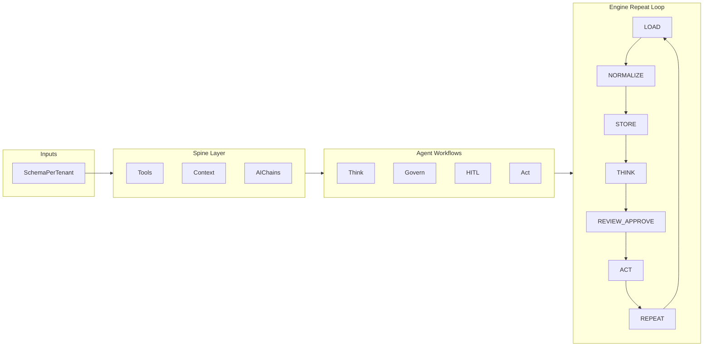

### Recommended layer order and flow (official sequence)

The clean architectural order is eight layers. Experience is not the source of truth for tenant identity; Gateway resolves tenant from JWT and injects trusted headers. Connector/loader do not directly become the durable business write path; raw external events do not bypass pipeline normalization.

**Official sequence:** (1) Experience Layer → (2) Gateway / Edge Layer → (3) Workspace Runtime → (4) External Connectivity → (5) Data Plane → (6) SSOT / Spine → (7) Cognitive Layer → (8) AI Providers. Action completion loops back: Cognitive → External Connectivity → Data Plane → SSOT → Workspace.

**Structural rule (tight):** Intent → Access → Bind → Ingest → Normalize → Persist → Reason → Approve → Act → Reconcile.

---

### Canonical fixed runtime path (all connectors, all flows until Entity 360)

Irrespective of connector, the live runtime path is fixed. Connector choice changes scopes, payload shape, and eligible schema; it does **not** change the platform path.

1. **Landing / Auth / Onboarding** create the **Initial Workspace** and seed `tenant_spine_config`.
2. **Connector chosen** from the onboarding-filtered list starts a **real connection** flow.
3. **OAuth or backend auth** runs, provider installation is discovered, and tokens are stored securely.
4. **Connection result is explicit.**
   - **Success:** persist connector state, sync `connected_connectors`, and trigger the first `phase: "creamy"` hydration.
   - **Fail:** persist connector error state and stop before the pipeline.
5. **Tenant-aware routing** resolves what the connector is allowed to contribute by combining connector class, onboarding department, desired outcome / user interest, and the resolved tenant schema. This is schema-driven, not manual record linking.
6. **`connector-sync`** creates the sync job, status, cursor state, and per-provider entity plan.
7. **`connector` / `loader`** run bounded extraction and enqueue one `stage: "analyze"` message per record into `PIPELINE_QUEUE`.
8. **`normalizer`** executes the 8 stages: Analyze → Classify → Filter → Refine → Extract → Validate → Sanity → Sectorize.
9. **`spine-v2`** writes canonical truth and records adaptive schema observations. Flow B also emits linked Knowledge payloads; Flow C continues on its knowledge-first path.
10. **Entity 360** is built at read time from Spine + Knowledge + Signals, with Knowledge UI included only when `link_knowledge_ui_to_entity360` is true.

**Operational rule:** The **Initial Workspace** becomes usable after **Creamy**. **Needed / deeper sync** and **Delta** continue afterward. The **intelligence layer should activate only after Creamy is complete and at least 2-3 meaningful connectors are loaded.**

#### Layer-to-surface mapping

| Layer          | Primary store / runtime                                                 | Product surface before agent execution                |
| -------------- | ----------------------------------------------------------------------- | ----------------------------------------------------- |
| **Spine**      | Supabase SSOT, canonical entities, relationships, schema observations   | Spine UI, dashboard truth panels, workspace lists     |
| **Context**    | Flow B `context_extractions`, `files`, Knowledge chunks                 | Context UI, citations, evidence surfaces              |
| **Knowledge**  | Flow C triage space + compounding space                                 | AI Chats, Triage Center Bot, No-Hallucination Library |
| **Entity 360** | Read-time fusion of Spine + Knowledge + Signals (+ optional Library)    | Account / contact / workspace 360 views               |

#### Fixed branch point for Flow A, Flow B, Flow C

| Flow   | Runtime branch                                                                                                        | Landing point before Entity 360                                               |
| ------ | --------------------------------------------------------------------------------------------------------------------- | ------------------------------------------------------------------------------ |
| **A**  | Structured connector payloads stay on the canonical queue path and write **directly** to Spine truth.                | Spine → Spine UI / dashboard / Entity 360 truth                               |
| **B**  | Unstructured content follows the same queue path, then dual-writes to Spine references and Knowledge chunks.         | Spine + Knowledge → Context UI / evidence / Entity 360                        |
| **C**  | AI chat / MCP / Slack / custom AI content lands in D1, then triage, approval, and compounding space.                | Knowledge UI / Library first; Entity 360 only when explicitly linked by flag  |

---

#### 1. Experience Layer

**Where:** apps/web, apps/dev-portal.

Starts the flow: onboarding, auth, connector selection, user intent / department / workspace context. All requests go to Gateway.

UI sends: `Authorization: Bearer <jwt>`, `x-view-context`; optional `x-idempotency-key`, `x-approval-token`. Experience Layer is **not** the source of truth for tenant identity.

---

#### 2. Gateway / Edge Layer

**Where:** services/gateway.

Single front door for: UI requests, MCP requests, webhook ingress, internal edge policy.

In order: verify JWT for authenticated routes; resolve tenant from JWT claims; inject trusted downstream headers (`x-tenant-id`, `x-user-id`, `x-user-role`); rate limit / basic policy; route to the right service. For webhook routes: skip JWT; verify provider signature or route only to a service that does; never trust tenant from incoming external headers/body.

---

#### 3. Workspace Runtime Layer

**Where:** services/workflow + Durable Objects.

Orchestration for user-facing workflows: workspace APIs, session/workspace orchestration, approvals / HITL, realtime state and stream fanout. Creates approval tasks, shows pending actions, updates action status after user decision, emits to intelligence-act.

---

#### 4. External Connectivity Layer

**Where:** connector, loader, mcp-connector, webhook-ingress, store.

Integration boundary. Sequence: (4.1) Connector setup — create connector config, define class, integration mode (OAuth, API, webhooks, MCP, files/store). (4.2) Auth / installation binding — OAuth or backend auth, store tokens, bind provider installation to tenant (e.g. tenant_id → hubspot → portal_id). (4.3) Data contract — objects to sync, field mappings, trigger model (initial sync, webhook, polling, MCP). (4.4) Ingestion entrypoints — webhook-ingress, loader sync, MCP invocation, file upload; all converge to the same downstream queue/pipeline contract.

---

#### 5. Data Plane Layer

**Where:** queues, pipeline, normalizer, spine-v2, KV/D1/R2.

Canonical ingestion and write path. (5.1) Raw event/data accepted from connector/loader/webhook/store/MCP: verify idempotency, attach trusted tenant binding, enqueue. (5.2) Pipeline / normalizer: ingest → verify → parse → map → normalize → enrich → persist → emit. (5.3) Spine writer (spine-v2): route by entity type, write canonical records, preserve source metadata, upsert semantics. (5.4) Operational state: KV for idempotency/cache, D1 for cursors/analytics, R2 for files/artifacts.

---

#### 6. SSOT Layer

**Where:** Supabase Postgres + pgvector.

Durable truth after normalization. Holds: canonical entities, action records, audit logs, connector installation references, knowledge-ready documents/chunks/metadata, vectorized searchable content. Workflow and intelligence read/write here; knowledge retrieves structured/unstructured data.

---

#### 7. Cognitive Layer

**Where:** services/intelligence, services/knowledge.

Runs after canonical data exists (except direct user-request flows). Consume intelligence-events, signals, intelligence-act; read from SSOT; think / govern / agent logic; knowledge retrieval if needed; create candidate actions; if risky send to workflow/HITL; if approved execute via act/connector; write outcomes back through pipeline/SSOT. Rule: cognitive services reason over canonicalized tenant-bound data, not raw external payloads whenever possible.

---

#### 8. AI Providers

**Where:** OpenRouter, OpenAI, Workers AI.

Downstream of intelligence, knowledge, agents (and sometimes connector-side AI). Provide inference, embeddings, classification, summarization, tool reasoning only. Not the system of record.

---

#### Trust and data boundaries

| Boundary                  | Role                                                                                                                           |
| ------------------------- | ------------------------------------------------------------------------------------------------------------------------------ |
| **Gateway**               | Trust boundary: JWT and tenant resolution; never trust external tenant from webhooks.                                          |
| **External Connectivity** | Integration boundary: OAuth, installation binding, all ingestion converges to one pipeline contract.                           |
| **Pipeline / Spine**      | Canonical data boundary: connector/loader do not directly write durable business data; raw events do not bypass normalization. |
| **Cognitive**             | Reasoning boundary: intelligence does not act on ambiguous tenant context; reads SSOT.                                         |
| **Workflow**              | User / HITL boundary: approval tasks and status updates.                                                                       |

Webhook routing must converge to one canonical entry path.

---

#### End-to-end sequence by use case

**A. User onboarding + connector connection**

1. Experience collects onboarding, goals, workspace type, and connector choice.
2. Gateway authenticates and injects tenant/user context.
3. Workflow stores onboarding state, seeds the Initial Workspace, and resolves baseline schema.
4. Real connection runs through OAuth or backend auth; provider installation / workspace binding is persisted.
5. Connection success or failure is surfaced immediately.
6. On success, connector lifecycle state is synced into tenant config and the first `phase: "creamy"` job is triggered.
7. `connector-sync` orchestrates provider/entity sync; `connector` / `loader` fetch bounded records and enqueue them into `PIPELINE_QUEUE`.
8. `normalizer` runs the 8 stages, writes canonical truth to Spine, and emits linked Knowledge payloads when Flow B applies.
9. Workspace UI becomes usable from Spine-backed creamy data; Needed / Delta continue in the background.
10. Entity 360 is available from Spine + Knowledge + Signals. Intelligence should activate only after Creamy is complete and at least 2-3 meaningful connectors are loaded.

**B. Webhook event flow**

1. External SaaS sends webhook.
2. Gateway forwards through verified webhook path.
3. Webhook-ingress or loader verifies signature + idempotency; installation mapping resolves tenant.
4. Event queued; pipeline/normalizer canonicalizes; Spine writes to SSOT.
5. Signals/intelligence events emitted; workflow/UI receive updates; intelligence may recommend or trigger an action.

**C. HITL action flow**

1. Intelligence identifies action opportunity; action record written to SSOT as pending approval.
2. Workflow creates HITL task / DO state.
3. User approves in UI; Gateway authenticates request.
4. Workflow updates action with approval token; intelligence-act queue receives approved action.
5. Intelligence/act validates approval + govern; connector executes external mutation.
6. Result re-enqueued to pipeline; pipeline updates SSOT; workspace/UI reflects final state.

---

#### Sequence diagram (onboarding, real connection, and initial hydration)

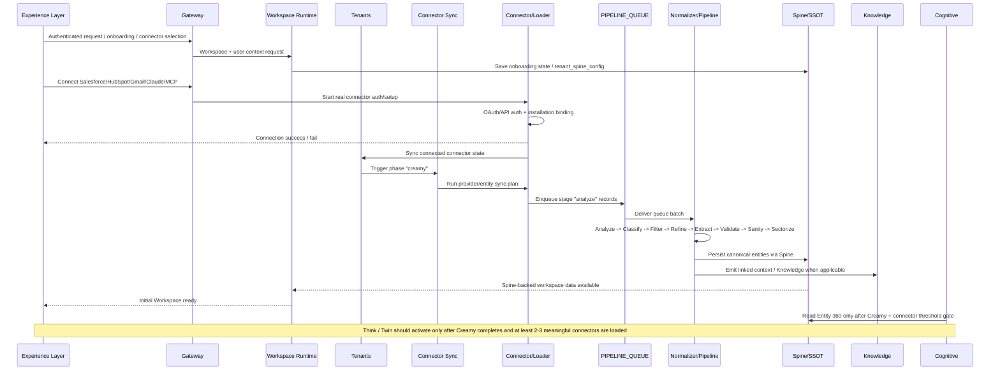

---

#### Three layers (summary view)

| View           | Layers                                                                                                                              |
| -------------- | ----------------------------------------------------------------------------------------------------------------------------------- |
| **Experience** | (1) Experience Layer + (2) Gateway + (3) Workspace Runtime — where real work and orchestration happen; user intent and approvals.   |
| **Cognitive**  | (7) Cognitive Layer + (8) AI Providers — reasoning, governance, knowledge, agents; no durable write without approval.               |
| **Backend**    | (4) External Connectivity + (5) Data Plane + (6) SSOT — integration, queue/pipeline, Spine/Knowledge; canonical ingest and persist. |

Flow: Experience → Gateway → Runtime/Connectivity → Queue/Pipeline → Spine/SSOT → Cognitive → Action Loop → Pipeline → Workspace Refresh.

### Data flow across phases

End-to-end data flow from landing through sync and cognitive loop. Phases are: Entry → Auth & Onboarding → Connect & Kickoff → Ingest & Spine → Workspace & Sync → Cognitive loop (repeat).

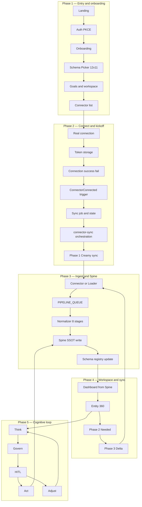

**Phase summary**

| Phase | Name                 | What flows                                                                               |
| ----- | -------------------- | ---------------------------------------------------------------------------------------- |
| 1     | Entry and onboarding | User → Auth → tenant_spine_config, baseline schema, connector list.                      |
| 2     | Connect and kickoff  | Real connection → success/fail → tenant-aware routing → `connector-sync` → Phase 1 Creamy. |
| 3     | Ingest and Spine     | Connector/Loader → `PIPELINE_QUEUE` → Normalizer 8 stages → Spine write → schema registry. |
| 4     | Workspace and sync   | Initial Workspace, dashboard, and Entity 360 read from Spine; Phase 2 Needed, Phase 3 Delta feed back to Loader. |
| 5     | Cognitive loop       | Entity 360 → Think → Govern → HITL → Act or Adjust; Act writes back via pipeline/Spine.  |

### How this flows in the workspace and enables compounding space benefit

The **workspace** is the user’s work layer: WorkspaceShell, BFF (dashboard, readiness, HITL, analytics), ContentRouter, and domain modules. The user sees **Entity 360** views (Spine + Knowledge + optional compounding space), approval queues, and Twin-driven proposals there. Data from phases 1–4 surfaces in the workspace as:

- **Dashboard and list views** — Built from Spine (and BFF) so the user sees current entities, status, and metrics.
- **Entity 360** — Fused at read time from Spine + Knowledge; when `link_knowledge_ui_to_entity360` is true, **compounding space** (Knowledge UI) is included so the same view carries approved AI-derived context.
- **HITL and workflows** — Proposals from Think appear in the workspace; the user approves, edits, or rejects; Act runs only after approval.

**Compounding space benefit:** Flow C (AI connectors, chat, MCP) lands in D1 and Knowledge UI (triage space + compounding space). Only **user-approved** items are promoted to the **compounding space** (Memory Consolidator → No-Hallucination Library). When `link_knowledge_ui_to_entity360` is true, Entity 360 (and the Twin) read that compounding space. So over time:

1. User works in the workspace (entities, chat, approvals).
2. Flow C conversations are triaged; user approves what matters.
3. Approved items are written to compounding space.
4. Entity 360 and Twin read compounding space, so the workspace view and AI context **include** that approved knowledge.
5. The next time the user (or Twin) sees an entity or asks a question, context is richer — the product compounds as a **knowledge layer** for that tenant.

So the phased flow (Entry → Connect → Ingest → Spine → Workspace & Sync → Cognitive loop) delivers a **compounding space benefit** by feeding the workspace from Spine and Knowledge and, when linked, from the compounding space that grows only from user-approved Flow C content.

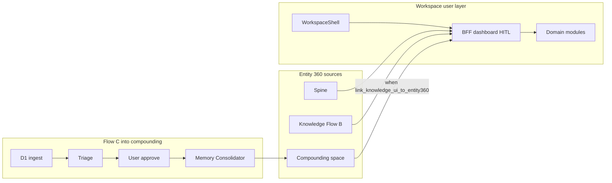

---

## 1. Flow A — Structured data (connectors → Spine)

Flow A is **structured** data from tools: CRM, billing, support, productivity, etc. It **links to truth** and lands in the **Spine**.

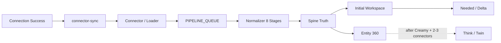

### 1.1 Path

| Step | Component                     | What happens                                                                                                                                                                                     |
| ---- | ----------------------------- | ------------------------------------------------------------------------------------------------------------------------------------------------------------------------------------------------ |
| 1    | **Connection success**        | Connector is authenticated, installation is bound to the tenant, `connected_connectors` is synced, and the first `phase: "creamy"` hydration is triggered.                                   |
| 2    | **Connector Sync**            | `connector-sync` creates sync status / cursor state and calls the connector service per provider + entity.                                                                                      |
| 3    | **Connector / Loader**        | `handleSync()` runs bounded extraction (`phase`, `since`, `cursor`, `limit`) and enqueues one `stage: "analyze"` record per entity into `PIPELINE_QUEUE`.                                    |
| 4    | **Pipeline / Normalizer**     | **8 stages:** Analyze → Classify → Filter → Refine → Extract → Validate → Sanity → Sectorize. Normalizer applies tenant entity-type filters, schema pruning, and canonical mapping.         |
| 5    | **Spine (`spine-v2`)**        | Sectorize writes via SPINE binding to `POST /v1/spine/{entity_type}` (primary path; legacy `/api/write` compatibility exists). Domain tables + tenant_id + adaptive schema observations.     |
| 6    | **Entity 360**                | Reads from Spine (and Knowledge + Signals). Flow A data is now in truth.                                                                                                                         |

**Webhook join point:** Webhook traffic does **not** bypass this path. It joins at the same `PIPELINE_QUEUE` boundary with `stage: "analyze"` and then follows the same Normalizer → Spine flow.

**Code:** Tenants `services/tenants/`; connector sync `services/connector-sync/`; loader `services/loader/`; Normalizer `services/normalizer/`; pipeline queue → sectorize → Spine. Connectors in `packages/connectors/`; catalog and registry define what syncs. **How this is Spine-based:** See §4 (connectors, loaders, normalizers, extraction, entity linking, context linking).

### 1.2 Sync phases (no full sync)

| Phase      | Goal                | When                                                                                                         |
| ---------- | ------------------- | ------------------------------------------------------------------------------------------------------------ |
| **Creamy** | First value in ~60s | Right after connect or “Sync now”; capped, high-value subset (e.g. top N accounts, open deals, last 7 days). |
| **Needed** | Only needed data    | After Phase 1 (~1 day); selective per tenant Spine schema + Depth Matrix; chunked, cursor-based.             |
| **Delta**  | Incremental         | After initial; cron or on-demand; only records created/updated since `since`.                                |

Parameters: `phase: 'creamy' | 'needed'`, `fullSync: false`, `since: <ISO>`, `cursor` where applicable. Sync status and cursors in KV and/or Supabase.

### 1.3 Flow A summary

| Item              | Spec                                                                                   |
| ----------------- | -------------------------------------------------------------------------------------- |
| **Connectors**    | Catalog connectors (CRM, billing, support, productivity, etc.); 50+; Spine-based only. |
| **Link to truth** | Yes. Flow A is structured truth.                                                       |
| **Landing**       | Connection success → `connector-sync` → connector/loader → `PIPELINE_QUEUE` → Normalizer → **Spine** → Entity 360. |

---

## 2. Flow B — Unstructured data (docs, mail, PDFs → Spine + Knowledge)

Flow B is **unstructured** data: Doc, Mail, PDF, Images, Chats. It **links to truth** via entity linking and lands in **Spine** (context_extractions, files, entity_type/entity_id) with **Knowledge** linked.

For full Flow B detail (ingestion entry points, entity linking strategies, dual write to Spine + Knowledge, schema alignment, governance), see [FLOW_B_UNSTRUCTURED_CONTEXT_INTEGRATION.md](FLOW_B_UNSTRUCTURED_CONTEXT_INTEGRATION.md).

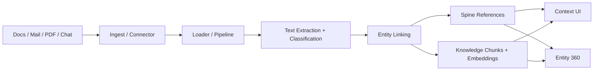

### 2.1 Path

| Step | Component             | What happens                                                                                                |
| ---- | --------------------- | ----------------------------------------------------------------------------------------------------------- |
| 1    | **Ingest**            | Connectors (Doc, Mail, PDF, etc.) or ingest API receive content.                                            |
| 2    | **Loader / pipeline** | Same 8-stage pipeline as Flow A (or ingest-specific path); entity extraction and classification.            |
| 3    | **Entity linking**    | Content is linked to Spine entities (entity_type, entity_id).                                               |
| 4    | **Spine**             | Structured extractions, file refs, context_extractions written to Spine.                                    |
| 5    | **Knowledge**         | Ingest to Knowledge (chunks, embeddings) with tenant_id, entity_type, entity_id. Feeds Context UI / IQ Hub. |
| 6    | **Entity 360**        | Reads Spine + Knowledge + Signals; Flow B content is in truth and linked context.                           |

**Path dependency:** Flow B lands in **Knowledge** when:

- **normalize() path:** Normalizer Accelerator NA5 writes to Spine and to Knowledge ingest.
- **Queue path:** Normalizer sectorize sends to KNOWLEDGE_QUEUE when bound. The knowledge-ingest consumer processes the payload (tenant_id, entity_type, entity_id, content). Both paths can feed Flow B Knowledge.

**Knowledge vs Knowledge UI:** **Knowledge** (Flow B) = document chunks, embeddings, entity-linked; written by Normalizer/ingest; read by Entity 360. **Knowledge UI** (Flow C) = triage write space + compounding space (separate store/schema); Entity 360 does **not** read Knowledge UI.

### 2.2 Flow B summary

| Item              | Spec                                                                                                                               |
| ----------------- | ---------------------------------------------------------------------------------------------------------------------------------- |
| **Connectors**    | Doc, Mail, PDF, Images, Chats.                                                                                                     |
| **Link to truth** | Yes. Flow B is evidence linking; docs stay intact and connected to Spine.                                                          |
| **Landing**       | Ingest → entity linking → **Spine** (context_extractions, files) + **Knowledge** linked. Entity 360 = Spine + Knowledge + Signals. |

---

## 3. Flow C — AI chat and Knowledge UI (governed, knowledge-first path)

Flow C is **AI connectors** and chat: custom connector, MCP, IntegrateWise connector, Slack. It lands in **D1** (ingest + 7-day memory) and **Knowledge UI** (Supabase: triage write space + compounding space). Only **Triage Center Bot** writes from D1 into Knowledge UI. **Memory Consolidator** promotes only **user-approved** items to the compounding space (No-Hallucination Library). **AI Twin**, **external AI connectors**, and **our MCP** read the Library; no other L2 or backend components do. Flow C does not directly create Spine truth rows.

For full Flow C detail (entry sources, two spaces, triage, user approval, who has access, implementation status), see [FLOW_C_AI_CHATS_KNOWLEDGE_AND_NO_HALLUCINATION_LIBRARY.md](FLOW_C_AI_CHATS_KNOWLEDGE_AND_NO_HALLUCINATION_LIBRARY.md).

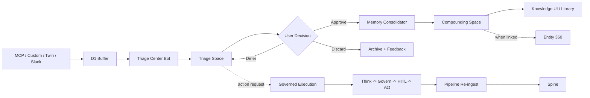

---

## 4. How connectors, loaders, normalizers, extraction, entity linking, and context linking are Spine-based

Everything in the ingestion and linking chain is **driven by the Spine**: what is allowed, what is written, and how context is tied to truth.

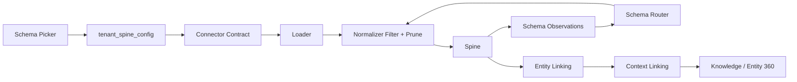

### 4.1 Connectors

- **Which connectors exist** — The 50-connector catalog is Spine-aligned (entity types and domains map to Spine schema). Connectors do not define their own schema; they are adapters that return provider-shaped data that the pipeline will **map into** Spine entity types.
- **Which connectors are offered** — Onboarding Schema Picker (industry × department) and `tenant_spine_config` drive which connectors are shown and connected. Connector list is filtered by department/industry so only **Spine-relevant** tools are offered. See [CONNECTOR_CATALOG_PLAN.md](architecture/CONNECTOR_CATALOG_PLAN.md) §5a.
- **What connectors do** — They **extract** data from the provider (sync or webhook). Extraction is **not** “dump everything”: sync contract uses `phase` (creamy/needed), `since`, `cursor`, and `limit` so the loader/pipeline receives a **bounded** stream. The **semantic boundary** of what matters is defined by the Spine (allowed entity types per tenant); connectors feed the pipeline, which then enforces that boundary.

### 4.2 Loaders

- **Loader** receives raw payloads from connectors (or ingest API) and runs the **8-stage pipeline** (or sends to PIPELINE_QUEUE for Normalizer to run the same stages).
- **Spine drives the pipeline:** Loader resolves **allowed domain keys** from `tenant_spine_config` (e.g. `getTenantAllowedDomainKeys`) and passes them into the pipeline context. So from the first stage, the pipeline is **tenant- and Spine-aware**.
- **Write plan:** If the pipeline’s write plan says “no spine”, the loader skips normalization/Spine write. So **whether data is stored at all** is decided by pipeline logic that is aligned with Spine/tenant config.
- **No parallel schema:** Loader does not write to any store that bypasses the Spine. All structured truth goes Connector → Loader (pipeline) → Normalizer → **Spine**.

### 4.3 Normalizers

- **Filter stage (Spine gate):** Normalizer reads **allowed entity types** for the tenant from `tenant_spine_config.domains` (mapped to `DOMAIN_TO_ENTITY_TYPES` or equivalent). In the **filter** stage, if the message’s `entity_type` is **not** in the tenant’s allowed set, the message is **dropped** (return null). So only **Spine-allowed entity types** reach sectorize and write.
- **Canonical mapping:** Refiner/extract stages normalize field names and map to **Spine-shaped** payloads (entity_type, name, source, source_id, data). The target shape is the Spine entity model, not provider-specific tables.
- **Sectorize → Spine:** Sectorize builds entities `{ entity_type, name, source, source_id, data }` and writes **only** to the Spine via `POST /v1/spine/{entity_type}` (primary route; `/api/write` remains legacy compatible). Spine-v2 writes to domain tables and calls **record_spine_field_observation** so `spine_schema_registry` grows. No write to a second “truth” store.
- **Code:** `getTenantAllowedEntityTypes(env, tenantId)` in Normalizer; filter stage uses it; sectorize writes to `env.SPINE` only.

### 4.4 Data extraction from connectors

- **Extraction** = what the connector returns (sync or webhook). It is **bounded** by:
  - **Contract:** phase (creamy/needed), since, cursor, limit — so we never “sync everything”.
  - **Schema:** Only entity types that exist in the **resolved Spine** (baseline ∪ tenant-grown) are **allowed through** the Normalizer filter. So effectively, “data extraction” that lands in the Spine is **Spine-schema-bound**: if the Spine does not allow that entity type for the tenant, the record is dropped in the filter stage.
- **Growth:** When new entity types appear in connector data and are written to the Spine, `record_spine_field_observation` updates `spine_schema_registry`. The Schema Router then **merges** baseline ∪ tenant-grown, so the **resolved Spine** can include the new type for that tenant. So extraction stays **schema-bound** while the schema itself **grows** with use.

### 4.5 Entity linking

- **Entity** = a row in the Spine (or its logical identity): `(tenant_id, entity_type, source, source_id)` with optional stable `entity_id` / spine_id for cross-reference.
- **Entity linking** = associating any other artifact (document, chunk, session, signal) to **that Spine entity** by storing **entity_type + entity_id** (where entity_id is the Spine identity: source_id or spine_id).
- **Where it happens:**
  - **Normalizer sectorize:** After writing to Spine, it can send to KNOWLEDGE_QUEUE with `tenant_id`, `entity_type`, `entity_id` (spineId). So every Knowledge chunk enqueued from the pipeline is **linked** to a Spine entity.
  - **Flow B (docs):** Entity linking step assigns `entity_type` and `entity_id` to content so that Spine and Knowledge share the same identity. Entity 360 then reads Spine + Knowledge joined by (entity_type, entity_id).
  - **Sessions (Flow C):** When AI sessions or triage items are linked to an account/contact, they store `entity_type` and `entity_id` (Spine identifiers) so evidence and context can be attached to the right entity. Linking is **to the Spine**, not to a separate graph.
- **Rule:** All entity linking uses **Spine entity_type and entity_id**. There is no separate “entity store”; the Spine is the source of entity identity.

### 4.6 Context linking

- **Context** = unstructured or semi-structured content that explains or evidences the **truth** (Spine): documents, chunks, sessions, signals.
- **Context linking** = storing that content with **tenant_id + entity_type + entity_id** so it can be retrieved “by entity”. Then Entity 360 (and Think) can aggregate **Spine (truth) + Knowledge (context)** by joining on (entity_type, entity_id).
- **Where it happens:**
  - **Normalizer → Knowledge:** Sectorize sends to KNOWLEDGE_QUEUE with `entity_type`, `entity_id`, `content`, `source_type`. Knowledge ingest stores chunks with those keys so search and Entity 360 can **link context to Spine entities**.
  - **Normalizer Accelerator NA5:** Writes **truth** to Spine (structured) and **context** to Knowledge with `entity_type`, `entity_id` as the **linkage key**. Same idea: every context artifact is tied to a Spine entity.
  - **Flow B:** Ingest → entity linking → Spine (context_extractions, files) + Knowledge (chunks with entity_type, entity_id). Context is never “floating”; it is always **linked to** a Spine entity.
- **Rule:** Context linking is **always** by (tenant_id, entity_type, entity_id). So the Spine is the **anchor** for all context; there is no context without a Spine entity link (or explicit “unlinked” bucket that is not used for Entity 360).

### 4.7 Summary (Spine at the center)

| Layer               | How it is Spine-based                                                                                  |
| ------------------- | ------------------------------------------------------------------------------------------------------ |
| **Connectors**      | Catalog and offering driven by Schema Picker (Spine); extraction bounded by contract.                  |
| **Loaders**         | Pipeline is tenant/Spine-aware (allowed domain keys); no write outside Spine path.                     |
| **Normalizers**     | Filter stage drops non–allowed entity types; sectorize writes only to Spine; canonical shape is Spine. |
| **Extraction**      | Effectively Spine-schema-bound (filter + sectorize); schema grows via spine_schema_registry.           |
| **Entity linking**  | All links use Spine entity_type + entity_id; Spine is the single entity identity.                      |
| **Context linking** | All context stored with (entity_type, entity_id) so it attaches to Spine entities.                     |

**Principle:** If it’s not in the Spine (or Spine-linked by entity_type + entity_id), it’s not in the system. Connectors, loaders, normalizers, extraction, entity linking, and context linking all happen **based on the Spine**.

---

## 5. Entity 360

**Entity 360** is the **single read-only view** that **Think** reads from. It aggregates:

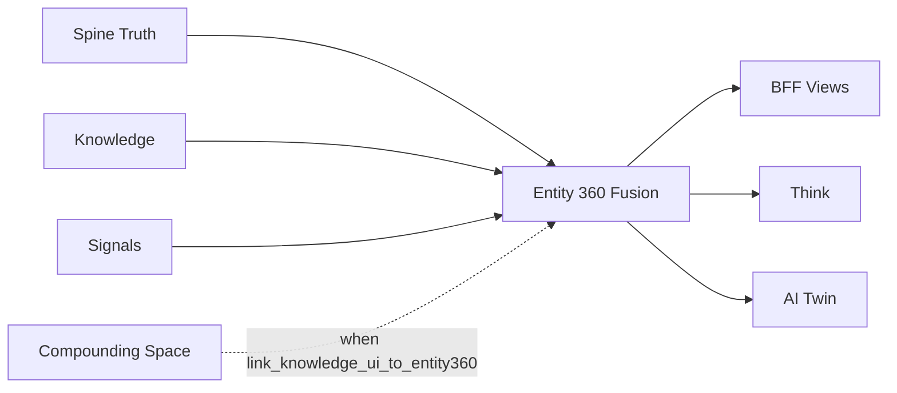

- **Spine** — All Flow A and Flow B truth (domain tables, context_extractions, files).
- **Knowledge** — Flow B linked content only (chunks, embeddings, entity_type/entity_id). Always included.
- **Knowledge UI (Flow C)** — When `depth_matrix_snapshot.link_knowledge_ui_to_entity360 = true` (from onboarding), Entity 360 may also include **compounding space** (Knowledge UI) for truth + context. When false, Knowledge UI is excluded. Implement via `getTenantLinkKnowledgeToEntity360(tenantId)` in `fuseSources`; see §18.1.
- **Signals** — Inbound from Normalizer (SIGNAL_QUEUE) and outbound from Think (e.g. when proposals are created). Consumed when building the view; may be persisted to D1 or Supabase for replay.

**Who builds it:** Entity 360 is a **real-time aggregation**, not a materialized table. **Think** builds it on demand via `fuseSources` (Spine + Knowledge + Signals APIs/stores). **BFF** can build a view (e.g. `buildAccount360View`) for dashboard/workspace. No separate “Entity 360 service”; the caller (Think or BFF) aggregates at read time.

**Rule:** Entity 360 base = **Flow A + Flow B only**. Flow C (Knowledge UI) is **optional** and gated by `link_knowledge_ui_to_entity360`. For **evidence_refs** and narratives, **Think** may **additionally** read AI sessions (e.g. from Knowledge UI or D1) **by entity link only** — so evidence can cite ai_session when linked to the same entity. That is a read path for Think only; Entity 360 remains A+B by default; A+B+C when linked.

**Use:** Think (and optionally AI Twin for insights) consumes Entity 360 to produce action_proposals, insights, and evidence_refs.

---

## 6. Think

For the dedicated agent execution reference covering Think, Govern, HITL, Act, Adjust, Agent Colony, AI Twin, evidence chain, triggers, and service bindings, see [AGENT_RUNS_GOVERNED_EXECUTION_LOOP.md](AGENT_RUNS_GOVERNED_EXECUTION_LOOP.md).

**Think** is the reasoning engine. It consumes **Entity 360** and (for grounding) the **No-Hallucination Library** (static: llm.txt, context.json; dynamic: compounding space when `link_knowledge_ui_to_entity360` is true). It may also read **decision_memory** (from Adjust) and, for evidence only, **AI sessions linked by entity**. It produces:

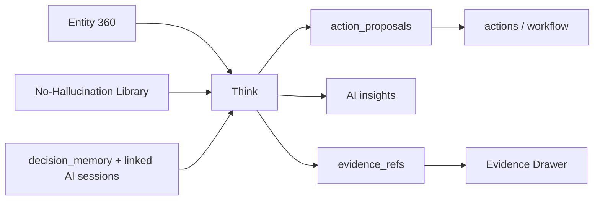

- **action_proposals** — Spine-shaped; proposed actions for Govern and HITL.
- **AI insights** — Proactive suggestions, daily insights, workflow ideas.
- **evidence_refs** — References to spine_signal, context_artifact, ai_session (when linked), etc.; persisted and shown in Evidence Drawer; used for narratives and traceability.

**Trigger:** Think runs **on demand** when the BFF/workspace requests insights, proactive suggestions, or the approval queue; and/or on a **schedule** (cron); and/or **event-driven** after pipeline/Store (e.g. when new data lands in Spine). The same trigger applies after ACT updates Spine — the next Think run occurs on the next such trigger (no separate “REPEAT” invocation). Implementation chooses one or more of: on-demand, cron, event.

**Proposal → HITL:** **Think** (or the orchestration layer that invokes Think) persists each action_proposal as a row in the **actions** table with status **Pending**. Govern then evaluates policy on that row; HITL queue shows the same row for Approve/Deny.

**Value rule:** Think delivers value only when it acts on **Spine-only** data (Entity 360 from Spine + Spine-linked Knowledge/Signals). Proposals and evidence must be traceable to Spine/context.

**Code:** `services/think/`; fusion (fuseSources), buildEvidenceRefs, proposal generation.

---

## 7. Govern

**Govern** is the **hard gate**: no execution without passing policy and (for ACT) a valid approval token.

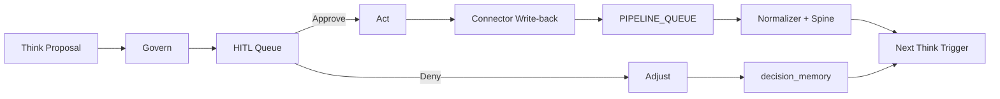

| Responsibility     | Spec                                                                                                                                                                                                                                                                                                                                        |
| ------------------ | ------------------------------------------------------------------------------------------------------------------------------------------------------------------------------------------------------------------------------------------------------------------------------------------------------------------------------------------- |
| **Policy check**   | Evaluate policy rules against tenant/role and proposal. Proposals that fail policy are not eligible for execution.                                                                                                                                                                                                                          |
| **Approval token** | **x-approval-token** is required **when invoking ACT**. The token is issued at **HITL Approve** (or from a prior auth step) and passed by the caller (BFF/frontend) when calling ACT. Govern’s role: ensure ACT is **never** invoked without a valid token and policy pass — e.g. ACT endpoint validates token and policy before executing. |
| **Inputs**         | Spine (current state) + proposal (action_proposal from Think).                                                                                                                                                                                                                                                                              |
| **Output**         | Allow or block; audit log entry; correlation_id.                                                                                                                                                                                                                                                                                            |

Govern runs **before** ACT executes (policy can be checked when the proposal is created or when ACT is invoked). HITL shows the queue without requiring a token; the user Approves or Denies; on Approve, the system issues or attaches the token and calls ACT. All material steps are logged with correlation_id, tenant_id, user_id, action_id, decision.

**Code:** `services/govern/`.

---

## 8. HITL (human-in-the-loop)

**HITL** is the human review step. Pending actions live in the **actions** table (Supabase) and/or Durable Object (DO). The UI shows an approval queue (Pending / Approved / Rejected).

| User action | Result                                                                        |
| ----------- | ----------------------------------------------------------------------------- |
| **Approve** | Action proceeds to **ACT** (execute).                                         |
| **Deny**    | Action goes to **ADJUST** (decision_memory, feedback to Think); no execution. |

**Workflow (BFF)** serves the queue: getApprovalQueue; on **Approve**, the frontend calls hitlAction(action_id, decision=approve) and the BFF (or backend) issues/attaches **x-approval-token** and invokes ACT with that token. On **Deny**, hitlAction(action_id, decision=deny) invokes ADJUST. Tenant and user resolved from auth and headers; RBAC applied.

---

## 9. Act

**Act** is the execution engine. It runs **only** when:

1. **Govern** allows (policy passed; approval token present when required).
2. **HITL** has approved the action.

**What Act does:** Executes the approved action: connector write-back, pipeline re-ingest, or other Spine/Knowledge updates. Writes back to Spine (and optionally Knowledge) so the next cycle sees updated data. **REPEAT:** After Spine is updated, the next Think run occurs on the **next Think trigger** (on-demand, cron, or event — see §5). No separate REPEAT step; the loop continues when Think runs again and reads the updated Entity 360.

**Code:** `services/act/`.

---

## 10. Adjust

**Adjust** runs when the user **denies** an action in HITL. It does **not** execute the action. It:

- Records **decision_memory** (why denied, context) in **Supabase** (e.g. `decision_memory` table or audit_log / actions table with decision metadata).
- Feeds **rejection feedback** back to Think: **Think** reads decision_memory in the **next cycle** (when building proposals or scoring) so future proposals can avoid similar suggestions. Optionally extraction/scoring/triage also consume it.

---

## 11. Evidence and audit

**Evidence** is recorded at multiple steps so every recommendation is traceable:

- **evidence_refs** — Built in Think fusion (spine, context, AI refs); persisted (e.g. D1/Supabase); linked to proposals.
- **Evidence Drawer** — UI/surface that shows evidence snapshot, signals, reasoning chain, and policy state behind a decision; supports Decision Replay.
- **Audit log** — Proposals, approvals, denials, ACT execution with correlation_id, tenant_id, user_id, action_id, decision. Compliance and traceability.

**Governance stages (full list):** Policy check (Govern), Audit log, Correlation ID (x-correlation-id), Approval token (x-approval-token), Tenant/role resolution, HITL, Idempotency (x-idempotency-key on writes), Evidence and citations.

---

## 12. Workflow (BFF)

The **workflow** service is the **BFF** (backend-for-frontend). It serves:

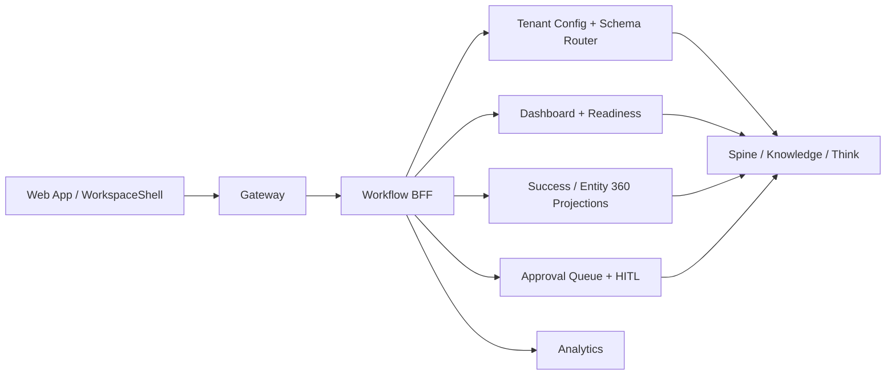

- **Tenant config** — initializeWorkspace, initializeAdaptiveSpine; tenant_spine_config; Schema Router (getAllowedEntityTypesForTenant, getTenantGrownSchema).
- **Readiness / dashboard** — getReadiness, projection, dashboard data.
- **HITL** — Approval queue (getApprovalQueue), hitlAction(action_id, decision).
- **Analytics** — Conversion, funnel, or other analytics endpoints used by the frontend.

All reads/writes are Spine-shaped and tenant-scoped. **Code:** `services/workflow/` (e.g. `index.ts`). **Gateway:** Routes under `/api/v1/workspace/*` (or as in API_ROUTES) → workflow Worker.

---

## 13. AI Twin

The **AI Twin** (cognitive / digital twin) is the agent that operates **within** the cognitive loop when “agents run”:

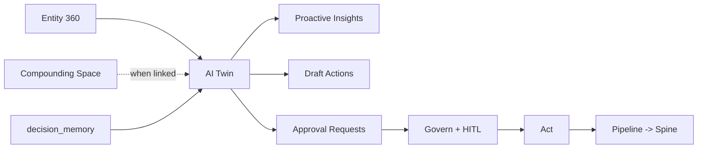

| Responsibility      | Spec                                                                                                                                                                                           |
| ------------------- | ---------------------------------------------------------------------------------------------------------------------------------------------------------------------------------------------- |
| **ACT**             | Executes approved actions: connector write-back, pipeline re-ingest; Spine updated.                                                                                                            |
| **REPEAT / ADJUST** | **REPEAT:** loop closure (Spine updated → next cycle). **ADJUST:** on deny, records decision_memory and feeds rejection back to Think.                                                         |
| **HITL**            | Surfaces approval queue; on user Approve/Deny, calls hitlAction so ACT or ADJUST runs.                                                                                                         |
| **AI insights**     | Proactive suggestions (twin/proactive), daily insights, workflow ideas, draft summaries and next steps (twin/act with draft_only). Uses Entity 360 + Library + decision_memory + drift_events. |

**Flow C and Twin:** For **Library (compounding space)** read access, the Twin reads the No-Hallucination Library (compounding space) **only when** `link_knowledge_ui_to_entity360` is true (from onboarding). When false, Twin does not read Knowledge UI. Twin reads **compounding space only** (not triage). Implement via `getTenantLinkKnowledgeToEntity360(tenantId)`; see §18.1, §18.6. Twin does **not** write to Spine or Entity 360; it executes only approved actions that write via connectors/pipeline.

**Endpoints (cognitive-brain):**

- `GET /api/v1/cognitive/twin/proactive`
- `GET /api/v1/cognitive/twin/memories`
- `POST /api/v1/cognitive/twin/act` (draft_only: true | false; false runs Govern then ACT)

---

## 14. Full loop (one sequence)

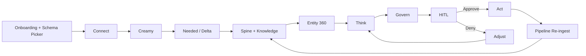

| #   | Step              | What happens                                                                                                                                                          |
| --- | ----------------- | --------------------------------------------------------------------------------------------------------------------------------------------------------------------- |
| 0   | **Onboarding**    | Industry + department (Schema Picker) → tenant_spine_config. Schema Router uses this for baseline (getSpineConfig). Adaptive Spine seeds via initializeAdaptiveSpine. |
| 1   | **LOAD**          | Connectors (Flow A/B) or ingest send data → Loader.                                                                                                                   |
| 2   | **8 stages**      | Pipeline: Analyze → Classify → Filter → Refiner → Extract → Validate → Sanity → Sectorize.                                                                            |
| 3   | **NORMALIZE**     | Normalizer: tenant filter, canonical mapping, sectorize.                                                                                                              |
| 4   | **STORE**         | Spine (and for Flow B, Knowledge linked). Entity 360 reads from here.                                                                                                 |
| 5   | **Entity 360**    | Read-only view: Spine + Knowledge + Signals (Flow A + B only).                                                                                                        |
| 6   | **Think**         | Consumes Entity 360 + Library; produces action_proposals, insights, evidence_refs.                                                                                    |
| 7   | **Govern**        | Policy check; approval token; audit.                                                                                                                                  |
| 8   | **HITL**          | Pending in actions table + DO; user Approve or Deny.                                                                                                                  |
| 9   | **ACT or ADJUST** | Approve → ACT (execute; write-back; re-ingest). Deny → ADJUST (decision_memory, feedback).                                                                            |
| 10  | **REPEAT**        | ACT → pipeline re-ingest → Spine updated; next Think run on next trigger (on-demand / cron / event) → loop continues.                                                 |

**Evidence and audit** are logged at every step. **Flow C** is separate as a knowledge-first path: it does not directly create Spine truth rows and feeds Knowledge UI + the No-Hallucination Library first (see §3 and Flow C doc). Truth updates, when needed, route through approved Act + pipeline.

---

## 15. Schema Picker, Adaptive Spine, and SSOT

The **Schema Picker** (schema selector) and **Schema Router** decide which Spine schema applies and how it grows. The **Spine (SSOT)** links everything.

**Flow position:** Schema Picker is **Step 0** in the full loop (§14): Onboarding (industry + department) → tenant_spine_config → Schema Router (baseline) → Loader/Normalizer/Think use it. Adaptive Spine grows from onboarding seed + connector sync → spine_schema_registry → Router merges baseline ∪ tenant-grown.

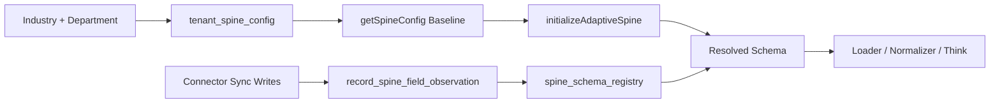

### 14.1 Schema Picker (industry × department)

**What it is:** The Schema Picker selects the **baseline schema** from onboarding. It uses **Trait** (department) × **Resource Type** (industry) — MuleSoft terminology; in IntegrateWise: **Department** × **Industry** from the 12×11 model.

| Input             | Source                      | Role                                                                           |
| ----------------- | --------------------------- | ------------------------------------------------------------------------------ |
| **Industry**      | Onboarding (Profile screen) | Resource Type; vertical schema extensions (entities, compliance per industry). |
| **Department(s)** | Onboarding (Profile screen) | Trait; functional layer (Sales, CS, RevOps, etc.).                             |
| **Output**        | `tenant_spine_config`       | `domains` = departments; `industry`; stored at workspace.initialize.           |

**Flow:** Onboarding collects industry + department → `workspace.initialize` → `tenant_spine_config` (domains, industry) → **Schema Router** reads this to resolve baseline via `getSpineConfig(industry, domain)`. For connector list filtering by department/industry (Step 4 Connect, at least 5 connectors), see [CONNECTOR_CATALOG_PLAN.md](architecture/CONNECTOR_CATALOG_PLAN.md) §5a.

**Code:** `services/workflow/` — `getSpineConfig(industry, department)` returns `entity_types`, `priority_fields` per (industry, department). BFF `initializeWorkspace` upserts `tenant_spine_config` with industry and domains from onboarding.

### 14.2 Adaptive Spine selection (Schema Router)

**Schema Router** resolves “which spine applies for this tenant” by merging **baseline** (industry × department) with **tenant-grown** state:

| Source           | What it provides                                                                                                                  |
| ---------------- | --------------------------------------------------------------------------------------------------------------------------------- |
| **Baseline**     | `getSpineConfig(industry, domain)` for each tenant domain → `entity_types`, `priority_fields`. From onboarding (Schema Picker).   |
| **Tenant-grown** | `spine_schema_registry` (tenant_id, entity_type, field_path) — observed fields and entity types from connector sync and pipeline. |

**Rule:** Resolved spine = **baseline ∪ tenant-grown**. Allowed entity types = baseline entity types ∪ entity types in `spine_schema_registry` for that tenant. So when the schema grows (new connector, new sync), the router picks it up without a code deploy.

**Code:** `getAllowedEntityTypesForTenant`, `getTenantGrownSchema`, `getAllowedEntityTypesForTenantWithGrowth` in `services/workflow/`. Dashboard, readiness, Loader, Normalizer, Think use these to scope to tenant’s allowed entity types.

### 14.3 How the Adaptive Spine grows

| Step | What happens                                                                                                                                                             |
| ---- | ------------------------------------------------------------------------------------------------------------------------------------------------------------------------ |
| 1    | **Onboarding** → `initializeAdaptiveSpine` seeds baseline via `record_spine_field_observation` (entity types, priority fields from getSpineConfig).                      |
| 2    | **Connector sync** → Pipeline writes entities → `record_spine_field_observation` called → new fields/entity types written to `spine_schema_registry` for that tenant_id. |
| 3    | **Schema Router** reads baseline + `spine_schema_registry` → resolved spine includes new types/fields.                                                                   |
| 4    | **Workspace, Loader, Normalizer, Think** use resolved spine (allowed entity types) so new data is admitted and shown.                                                    |

**Growth loop:** More connectors → more syncs → more rows in `spine_schema_registry` → Schema Router merges → Adaptive Spine grows per tenant. No deploy needed.

### 14.4 SSOT links everything

The **Spine (SSOT)** is the single source of truth. It links:

| Link                   | How                                                                                                                   |
| ---------------------- | --------------------------------------------------------------------------------------------------------------------- |
| **Onboarding → Spine** | industry + departments → tenant_spine_config → Schema Picker/Router → baseline schema.                                |
| **Connectors → Spine** | Sync → pipeline → Normalizer → Spine write; `record_spine_field_observation` → spine_schema_registry → schema growth. |
| **Spine → Entity 360** | Entity 360 reads Spine + Knowledge + Signals; Think consumes Entity 360.                                              |
| **Spine → L2**         | Think, Govern, Act, Adjust read/write Spine-shaped data only.                                                         |
| **Spine → Workspace**  | Nav, modules, dashboard, readiness all driven by tenant_spine_config + Schema Router (allowed domains, entity types). |

**Principle:** If it’s not in the Adaptive Spine (or Spine-linked), it’s not in the system. Connectors, onboarding, cognitive layer, flows, load, sync — everything derives from and runs on the Spine.

---

## 16. Resolved design choices (summary)

| Topic                         | Decision                                                                                                                                                                                                                            |
| ----------------------------- | ----------------------------------------------------------------------------------------------------------------------------------------------------------------------------------------------------------------------------------- |
| **Think trigger**             | On-demand (BFF/workspace request), and/or cron, and/or event after Store. Next Think after ACT = next such trigger.                                                                                                                 |
| **Proposal → HITL**           | Think (or orchestration) persists action_proposal → `actions` table, status Pending; Govern evaluates; HITL shows same row.                                                                                                         |
| **Approval token**            | Issued at HITL Approve; passed when calling ACT. Govern ensures ACT is never invoked without valid token + policy pass.                                                                                                             |
| **Entity 360**                | Real-time aggregation by Think (fuseSources) and BFF (buildAccount360View); not a materialized table.                                                                                                                               |
| **AI sessions in evidence**   | Entity 360 stays A+B only; Think may additionally read AI sessions by entity link for evidence_refs only.                                                                                                                           |
| **Knowledge vs Knowledge UI** | Knowledge = Flow B (chunks, entity-linked). Knowledge UI = Flow C (triage + compounding). Entity 360 reads Knowledge always; when link_knowledge_ui_to_entity360=yes, Entity 360 and Twin may also read Knowledge UI (compounding). |
| **Flow B + Knowledge**        | Both paths can feed: normalize()/NA5 → Spine + Knowledge; queue path (KNOWLEDGE_QUEUE when bound) → Knowledge. §2 clarified.                                                                                                        |
| **REPEAT**                    | Next Think run = next trigger (same as above); no separate REPEAT invocation.                                                                                                                                                       |
| **decision_memory**           | Stored in Supabase (e.g. decision_memory or audit); Think reads in next cycle.                                                                                                                                                      |
| **Signals**                   | Normalizer → SIGNAL_QUEUE; Think may produce signals. Consumed when building Entity 360 (fuseSources); optionally persisted to D1/Supabase.                                                                                         |

---

## 17. Logical and practical gaps (audit)

Gaps identified between spec, code, and docs. Resolve before flagship Work experience.

### 17.1 Implementation gaps

| Gap                                  | Severity | Status     | Resolution applied                                                                                                                                                                                                                                 |
| ------------------------------------ | -------- | ---------- | -------------------------------------------------------------------------------------------------------------------------------------------------------------------------------------------------------------------------------------------------- |
| **HITL → ACT format mismatch**       | High     | ✓ Resolved | Act service `/execute` now accepts **both** `action_id` (from actions table) and `action_proposal_id` (from action_proposals). Workflow handleApproval → ACT_QUEUE → intelligence-act → Act handles HITL path.                                     |
| **Flow B Knowledge queue path**      | Medium   | doc        | Normalizer sectorize sends to KNOWLEDGE_QUEUE when bound. §2 clarified: both paths can feed Knowledge. Flow B Knowledge = chunks/embeddings; Knowledge UI = triage/compounding.                                                                    |
| **Think → actions persistence**      | Medium   | doc        | Intelligence signals path writes to `actions` when `requiresApproval`. Think processEvent creates proposals in D1 action_proposals. Bridge: when Think returns proposals with requires_approval, orchestration should persist to Supabase actions. |
| **Approval token validation in ACT** | Medium   | ✓ Resolved | Act validates `approval_token` against the actions row before executing when `action_id` path is used. Rejects with 403 if invalid or missing.                                                                                                     |

### 17.2 Docs vs code mismatches

| Gap                                            | Status     | Resolution applied                                                                    |
| ---------------------------------------------- | ---------- | ------------------------------------------------------------------------------------- |
| **Onboarding steps**                           | ✓ Resolved | ONBOARDING_FLOW.md updated to 4-screen flow. Step mapping documented.                 |
| **Progressive hydration**                      | doc        | Only Profile (step 1) triggers `workspace.initialize`. Documented in ONBOARDING_FLOW. |
| **initializeSpine vs initializeAdaptiveSpine** | —          | Naming consistent. No change needed.                                                  |

### 17.3 Logical gaps

| Gap                     | Status | Resolution applied                                                                                                                           |
| ----------------------- | ------ | -------------------------------------------------------------------------------------------------------------------------------------------- |
| **Skip Profile**        | ✓ doc  | Documented in ONBOARDING_FLOW: Skip Profile → defaults (SAAS_TECH, SALES, startup). Schema Picker always has baseline.                       |
| **Personal usage type** | doc    | Documented: orgType=PRODUCT; Schema Router uses BIZOPS or first department as fallback when domains minimal.                                 |
| **Flow C Defer**        | doc    | Spec: Approve / Discard / Defer. Defer optional; Memory Consolidator promotes only approved. UI: add Defer when triage UI is built.          |
| **Think trigger**       | doc    | Loader sends to THINK_QUEUE; intelligence worker consumes intelligence-events. Triggers: on-demand (BFF/workspace), cron, event after Store. |

### 17.4 Schema and data flow

| Gap                                | Description                                                                                       | Resolution                          |
| ---------------------------------- | ------------------------------------------------------------------------------------------------- | ----------------------------------- |
| **record_spine_field_observation** | ✅ Implemented: spine-v2 calls it on write; Normalizer → SPINE (spine-v2) → write + observations. | —                                   |
| **Schema Router**                  | ✅ Implemented: getAllowedEntityTypesForTenantWithGrowth merges baseline ∪ tenant-grown.          | —                                   |
| **workspaceType**                  | Added to onboarding and `workspace.initialize`; BFF stores in depth_matrix_snapshot.              | Verify migration/columns if needed. |

### 17.5 Resolution summary

| Priority | Item                   | Status                                                             |
| -------- | ---------------------- | ------------------------------------------------------------------ |
| 1        | HITL → ACT format      | ✓ Resolved (Act handles both action_id and action_proposal_id)     |
| 2        | Approval token in ACT  | ✓ Resolved                                                         |
| 3        | Onboarding docs        | ✓ Resolved (4-screen flow)                                         |
| 4        | Flow B Knowledge       | doc (§2 clarified)                                                 |
| 5        | Think → actions bridge | doc (orchestration to persist when processEvent returns proposals) |

### 17.6 End-to-end completeness (new gaps)

For full audit, see [END_TO_END_COMPLETENESS_AUDIT.md](END_TO_END_COMPLETENESS_AUDIT.md). For implementation resolution plan, see §18.

| Gap                                                | Severity | Status     | Action                                                                                                                                                |
| -------------------------------------------------- | -------- | ---------- | ----------------------------------------------------------------------------------------------------------------------------------------------------- |
| **Flow C: Memory Consolidator user-approval gate** | P0       | ✓ Resolved | fetchApprovedTriageItems filters approval_status='approved'; PATCH /v1/triage/:id; migration 058.                                                     |
| **link_knowledge_ui_to_entity360 consumer**        | P0       | ✓ Resolved | getTenantLinkKnowledgeToEntity360 in tenant-spine-config; Entity 360 (views), Think (engine, fusion), Twin (cognitive-brain) gate by it.              |
| **Flow C two spaces**                              | P1       | ✓ Resolved | GET /v1/knowledge/inbox (triage); POST /knowledge/search (compounding); gateway rewrites.                                                             |
| **Strategic Hub / goals trackable**                | P1       | ✓ Resolved | GET /api/v1/workspace/goals; StrategicHubView; strategic-hub module.                                                                                  |
| **Twin Library-only**                              | P2       | ✓ Resolved | cognitive-brain twin endpoints call getLinkKnowledgeUI; link_knowledge_ui in response; compounding only.                                              |
| **Inbox UI wire**                                  | P2       | ✓ Resolved | TriageView: Inbox card uses knowledge.inbox() and knowledge.triage.update(id, action); Approve/Discard/Defer call PATCH /api/v1/knowledge/triage/:id. |
| **Migration 058**                                  | P2       | Open       | Apply 058_triage_approval_status.sql if not yet run on target DB.                                                                                     |

---

## 18. Implementation resolution plan

Concrete steps to close the gaps in §17.6. Execute in the order below.

### 18.1 P0 — link_knowledge_ui_to_entity360 consumer

**Chosen approach:** Central config helper + gate at each consumer.

| Step | Action                                                                                                                                                                                                                                                     |
| ---- | ---------------------------------------------------------------------------------------------------------------------------------------------------------------------------------------------------------------------------------------------------------- |
| 1    | Add `getTenantLinkKnowledgeToEntity360(tenantId)` in `services/workflow/tenant-spine-config.ts` (or equivalent). Reads `tenant_spine_config.depth_matrix_snapshot->>'link_knowledge_ui_to_entity360'`; returns boolean (default true for backward compat). |
| 2    | **Entity 360:** In `fuseSources` (or caller), when building context: if `getTenantLinkKnowledgeToEntity360(tenantId)` is false, do not include Knowledge UI (compounding) in aggregation.                                                                  |
| 3    | **Think:** In `cognitive-brain.ts`, context-to-truth, twin endpoints: before including Knowledge UI in context, call the helper; when false, skip Knowledge UI.                                                                                            |
| 4    | **Twin:** In `twin/proactive`, `twin/memories`, `twin/act`: same gate — include Knowledge UI only when flag is true.                                                                                                                                       |

**Code paths:** `services/workflow/src/tenant-spine-config.ts`; `services/think/src/fusion.ts`; `services/think/src/cognitive-brain.ts`; Twin endpoints (cognitive-brain or agents).

---

### 18.2 P0 — Flow C: Memory Consolidator user-approval gate

**Chosen approach:** Add `approval_status` to triage flow; Consolidator filters by approved only.

| Step | Action                                                                                                                                                                                                                                                  |
| ---- | ------------------------------------------------------------------------------------------------------------------------------------------------------------------------------------------------------------------------------------------------------- |
| 1    | **Schema:** Add `approval_status` to `triage_results` (or create `session_summaries` table): `'pending'                                                                                                                                                 |
| 2    | **API:** Add `PATCH /api/v1/knowledge/triage/{id}` (or `/api/v1/knowledge/inbox/{id}`) with body `{ action: 'approve'                                                                                                                                   |
| 3    | **Memory Consolidator:** Change input source from IQ_HUB sessions to triage items. Query triage space (e.g. `triage_results` or `session_summaries`) where `approval_status = 'approved'` only. Promote those to `consolidated_memories` (compounding). |
| 4    | **Triage Center Bot:** When writing from D1 to Supabase, set `approval_status = 'pending'` by default.                                                                                                                                                  |

**Alternative:** Extend `triage_actions.action_type` with `'approved'` and `'discarded'`; Consolidator joins and filters by `action_type = 'approved'`. Keeps triage schema; adds join.

---

### 18.3 P1 — Flow C two spaces

| Step | Action                                                                                                                                                                                                                 |
| ---- | ---------------------------------------------------------------------------------------------------------------------------------------------------------------------------------------------------------------------- |
| 1    | **API split:** `GET /api/v1/knowledge/inbox` → triage write space only (items with approval_status pending/deferred). `GET /api/v1/knowledge/search` → compounding space only (`consolidated_memories` or equivalent). |
| 2    | **Inbox UI:** TriageView (or Inbox component) lists triage items; each row has Approve / Discard / Defer buttons. On click, call `PATCH /api/v1/knowledge/triage/{id}` with action.                                    |
| 3    | **Search:** Ensure search endpoint queries compounding space only; never returns triage working area.                                                                                                                  |

---

### 18.4 P1 — Think → actions bridge

**Chosen approach:** Bridge in intelligence worker (or BFF) when Think returns proposals with `requires_approval`.

| Step | Action                                                                                                                                                                                                       |
| ---- | ------------------------------------------------------------------------------------------------------------------------------------------------------------------------------------------------------------ |
| 1    | When `processEvent` (or equivalent) consumes `intelligence-events` and Think returns proposals with `requires_approval: true`, orchestration inserts each into Supabase `actions` with `status = 'pending'`. |
| 2    | Use the returned `action_id` for Govern/HITL; HITL queue shows the same row.                                                                                                                                 |
| 3    | **Code path:** `services/intelligence/src/index.ts` (queue consumer) or `services/workflow/` (BFF) — wherever Think is invoked and proposals are processed.                                                  |

---

### 18.5 P1 — Strategic Hub / goals trackable (Rule 14)

| Step | Action                                                                                                                                                                         |
| ---- | ------------------------------------------------------------------------------------------------------------------------------------------------------------------------------ |
| 1    | **API:** Add `GET /api/v1/workspace/goals` or `GET /api/v1/spine/goals` that returns `spine.goal` and `spine.metric` for the tenant.                                           |
| 2    | **UI:** New Strategic Hub module (Work → Strategic Hub) or section in dashboard. Lists goals, metrics, optional ROI mapping. Reuse `goal-schema`, `goal-context`; wire to API. |
| 3    | **Minimal:** Simple list view of goals and metrics; expand later to full Strategic Hub.                                                                                        |

---

### 18.6 P2 — Twin Library-only

| Step | Action                                                                                                                                                                                                 |
| ---- | ------------------------------------------------------------------------------------------------------------------------------------------------------------------------------------------------------ |
| 1    | Twin endpoints (proactive, memories, act): call `getTenantLinkKnowledgeToEntity360(tenantId)`. If true, read Knowledge UI **compounding space only** (not triage). If false, do not read Knowledge UI. |
| 2    | Ensure Knowledge search/read API used by Twin returns compounding space only.                                                                                                                          |

---

### 18.7 P2 — Slack Flow C path

| Step | Action                                                                                                                    |
| ---- | ------------------------------------------------------------------------------------------------------------------------- |
| 1    | Add Slack app: listens for session summaries (or messages). Posts summary to D1 (or triage space) via Knowledge API.      |
| 2    | Emoji reactions (e.g. ✅ approve, ❌ discard) → webhook → `PATCH /api/v1/knowledge/triage/{id}` to set `approval_status`. |
| 3    | Reuse Slack webhook infra from Flow A/B.                                                                                  |

---

### 18.8 P2 — Analytics wiring

| Step | Action                                                                                                                     |
| ---- | -------------------------------------------------------------------------------------------------------------------------- |
| 1    | Verify `apps/web` calls workflow analytics (e.g. `POST /api/v1/analytics/events`) on signup, conversion, key funnel steps. |
| 2    | Check `packages/analytics/` — ensure it calls real backend or third-party; no mocks in production.                         |
| 3    | RUM: add `performance_metrics` collection (e.g. reportWebVitals) and send to workflow analytics.                           |

---

### 18.9 Execution order

| Order | Item                                    | Dependency                       |
| ----- | --------------------------------------- | -------------------------------- |
| 1     | link_knowledge_ui_to_entity360 consumer | None; small, localized           |
| 2     | Flow C approval gate                    | None; unblocks two spaces        |
| 3     | Flow C two spaces                       | Depends on approval gate         |
| 4     | Think → actions bridge                  | None                             |
| 5     | Strategic Hub                           | None                             |
| 6     | Twin Library-only                       | Can combine with (1)             |
| 7     | Slack Flow C                            | Optional; depends on Slack usage |
| 8     | Analytics wiring                        | None                             |

**§18.7 (Slack Flow C) and §18.8 (Analytics wiring)** remain in the resolution plan as open items: steps and execution order above apply when prioritized; no change to their scope or placement.

---

## 19. Technical Appendix — End-to-End Validation (Flow A: Structured Truth)

Flow A covers the complete structured-data integration path: Landing → Auth → Onboarding → Connector OAuth → Adaptive Schema → 8-Stage Pipeline → Spine SSOT → Dashboard → Real-Time Sync. The following validates each step for logical completeness.

**Purpose.** This appendix confirms that the Flow A path is logically complete and implementable: every step has a defined input, output, and Spine or tenant linkage where applicable. It ensures no step is missing for a user to go from landing to seeing structured data in the workspace.

**Focus areas.** (1) Tenant and schema establishment before any business data is written. (2) Connector OAuth and token storage with an explicit initial-sync trigger. (3) Pipeline and Normalizer strictly bound to the resolved Spine schema. (4) Dashboard and real-time sync reading only from the Spine (SSOT). All focus areas are tied to the Spine as the single source of truth.

### 19.1 Landing

The user accesses the marketing or app URL. The front-end serves static content (product info, CTAs). No back-end integration processes or external data calls are made. Optional analytics tracking events (page visits, CTA clicks) may fire to the internal analytics API. No data integration yet; the next meaningful step begins when the user clicks a CTA to proceed to login/signup.

**Completeness:** Straightforward; no additional integration logic needed.

### 19.2 Authentication (PKCE)

Upon clicking "Get Started" or "Log In," the user enters the Supabase PKCE OAuth2/OIDC flow.

- **PKCE OAuth Flow:** The front-end presents login/signup; Supabase Auth handles the PKCE exchange (authorization code → access token), ensuring the code exchange is not interceptable.
- **Token Issuance:** Supabase issues a JWT containing user identity, stored client-side for authenticated requests.
- **Onboarding Flag Check:** The BFF inspects `user_metadata` for `onboarding_complete`. If false → Onboarding (step 3); if true → Workspace dashboard.
- **Session Establishment:** The front-end API client attaches `Authorization: Bearer <token>` and `x-tenant-id` on all subsequent calls.
- **Tenant Provisioning:** For new users, the system creates a tenant record. For individual sign-ups, `tenant_id` = `user_id`; for business sign-ups, `tenant_id` represents the organization. After auth, a tenant identifier is established to scope all data operations.

**Completeness:** Auth is complete. Tenant identification/creation is a necessary implied step.

### 19.3 Onboarding (Four-Screen Flow)

For first-time users (`onboarding_complete = false`), a four-screen wizard collects configuration data and initializes the workspace.

- **Screen 0 — Welcome & Usage:** Gathers usage context (personal/work/business) and organization type. Stored in user profile or temporary session state.
- **Screen 1 — Profile (Schema Selection):** Collects industry (resource type) and department (trait). The front-end calls `workspace.initialize` which upserts `tenant_spine_config` with chosen industry, departments, organization type, workspace name. The Schema Router retrieves the baseline canonical schema for the tenant's industry × department combination — the initial set of entity types and fields.
- **Screen 2 — Goals & Workspace Details:** Collects workspace name, goals, workspace type (demo/production), and optionally `link_knowledge_ui_to_entity360` flag. Updates `tenant_spine_config` with `desiredOutcome`, `workspaceName`, and `depth_matrix_snapshot`.
- **Screen 3 — Connect (Connectors):** Presents a dynamically filtered list of connectors based on industry and department. At least 5 connectors per choice. The front-end calls the Connector Catalog API with industry/department as query parameters; the catalog returns connectors tagged with matching industries/departments.

**Completeness:** Onboarding is well-represented. The exact point of canonical schema hydration is during Screen 1 or via `initializeSpine` — the Schema Picker inputs determine the initial Spine shape.

### 19.4 Connector OAuth Handshake & Token Storage

For each selected connector, the system runs an OAuth 2.0 authorization sequence.

- **OAuth Authorization:** The user clicks "Connect," the front-end redirects to the external provider's authorization page. The user grants access.
- **Callback & Token Exchange:** The external service redirects to `/oauth/callback/:provider` with an authorization code. The back-end exchanges the code (with PKCE verifier or client secret) for access + refresh tokens, server-to-server.
- **Secure Token Storage:** OAuth tokens are encrypted and stored in `connected_connectors` (within `tenant_spine_config`) or a secrets store. Never exposed to the client.
- **Connector Registration:** The platform marks the connector as "connected" for the tenant; updates `connected_connectors` list.
- **Connection Success / Fail:** The result must be explicit. On success, the connector enters active state and the tenant’s connector lifecycle is updated; on fail, the connector remains disconnected and no pipeline activity begins.
- **Trigger Initial Sync:** Immediately after successful connection, the tenant lifecycle path triggers the first `phase: "creamy"` sync via `connector-sync`. Without this trigger, data would not begin flowing.

**Completeness:** The main addition is explicitly including the initial sync trigger after the OAuth handshake.

### 19.4A Post-Connect Kickoff: Initial Sync Orchestration (what happens immediately after OAuth)

Once the connection has completed successfully, the platform runs the following **actual queue-based runtime chain**. This is the live path used by the current services.

1. **Tenant lifecycle update**
   - The platform syncs connector lifecycle state into tenant config (`connected_connectors`) and treats the provider as active for that tenant.

2. **Initial creamy trigger**
   - The tenants/runtime layer calls `connector-sync` with `provider` + `phase: "creamy"`.
   - This is the first post-connect hydration step.

3. **Sync job + cursor state**
   - `connector-sync` creates the sync job, stores status in KV, resolves entity list for the provider, and decides whether the run is Creamy, Needed, or Delta.

4. **Provider/entity fan-out**
   - For each provider + entity type pair, `connector-sync` calls the connector service sync endpoint.

5. **Loader extraction**
   - The connector service falls through to `loader.handleSync()`.
   - `handleSync()` runs bounded extraction via `universalSync()` using `phase`, `since`, `cursor`, and `limit`.
   - Each extracted record is enqueued into `PIPELINE_QUEUE` with `stage: "analyze"`.

6. **Canonical queue path**
   - The pipeline worker receives the batch and hands queue processing to the Normalizer.
   - The Normalizer advances the message through the **8 stages**:
     **Analyze → Classify → Filter → Refine → Extract → Validate → Sanity → Sectorize.**

7. **Schema-bound write**
   - Only entity types and fields allowed by the tenant’s resolved schema survive filter + pruning.
   - Sectorize writes the canonical entity to `spine-v2` via `POST /v1/spine/{entity_type}`.

8. **Schema growth on write**
   - `spine-v2` records adaptive schema observations during the write so `spine_schema_registry` grows with real tenant data.

9. **Flow split after canonicalization**
   - **Flow A:** structured truth lands in Spine.
   - **Flow B:** linked context is also emitted to Knowledge using the same `(tenant_id, entity_type, entity_id)` anchor.
   - **Flow C:** remains knowledge-first and does not write to Spine directly here.

10. **Workspace readiness**
    - The Initial Workspace becomes usable from Creamy data as soon as Spine-backed reads succeed.
    - Needed / deeper sync and Delta continue afterward.

11. **Entity 360**
    - Entity 360 is built at read time from Spine + Knowledge + Signals.
    - Intelligence should activate only after Creamy completes and at least 2-3 meaningful connectors are loaded.

**Completeness:** This subsection now ties the "connect → data starts flowing" moment to the live runtime chain: tenant lifecycle update → `connector-sync` → connector/loader extraction → `PIPELINE_QUEUE` → Normalizer → `spine-v2` → schema growth → workspace readiness → Entity 360.

### 19.5 Adaptive Schema Generation (initializeSpine & Schema Router)

The tenant now has: (a) baseline Spine schema from onboarding, (b) list of connected connectors. The platform combines these to finalize the Adaptive Schema.

- **Seeding spine_schema_registry:** The BFF calls `workspace.initializeSpine` (or `initializeAdaptiveSpine`) with primary domain, industry, and connector list. The back-end populates `spine_schema_registry` with initial entity types and fields — "initial observations for primary domain and connectors." The connectors influence the schema: if the user's connectors manage certain data (e.g., Tickets from a support system), the entity type and its core fields are added to the registry.
- **Schema Router Resolution:** The Schema Router merges baseline schema + tenant-specific extensions from `spine_schema_registry` to compute the **resolved schema** — the allowed entity types and fields for this tenant's pipeline. Initially, tenant-specific extensions are just the seeded baseline + known connector structures.
- **No Data Yet:** At this stage, only schema information has been written. No business data in the Spine yet. The real data flow starts when the Loader begins pulling records (triggered in step 4).

**Completeness:** Schema resolution precedes data classification and normalization. The spine_schema_registry is in place from the start of data ingestion.

### 19.6 Type Classification & Schema Enforcement

As the initial sync proceeds, the pipeline classifies and gates incoming records.

- **Data Type Classification:** The pipeline's Classify stage examines each payload to determine its canonical entity_type (Contact, Account, Opportunity, etc.), using connector context and data content.
- **Enforcing Allowed Entity Types:** The Filter stage references the resolved schema from the Schema Router. If the classified `entity_type` is not in the tenant's allowed list, the record is dropped. The `tenant_spine_config` acts as a real-time gatekeeper.
- **Timing:** Schema resolution (Schema Router) occurs before and during data loading. The baseline schema is established at onboarding. Classification happens within the pipeline (Classify stage), immediately followed by filtering against the pre-computed allowed-type list.
- **Connector Metadata Influence:** Connectors offered based on industry/department produce data types that generally align with allowed types. If a connector sends data outside expected types, the filter drops it.

**Completeness:** Type classification is part of the 8-stage pipeline; tenant-specific schema rules are applied after the record's type is discerned.

### 19.7 Loader: 8-Stage Pipeline Execution

The Loader initiates and manages data retrieval and processing.

- **Bounded Data Fetch (Phase "Creamy"):** The Loader invokes connector extraction with parameters: `phase` (creamy), `since`/`cursor`, `limit`. Phase 1 targets recent/high-priority records (e.g., last 7 days or top N records) for fast initial value.
- **Actual Runtime Path:** In the live connector flow, the Loader is normally entered via `connector-sync` → connector service → `handleSync()`. `handleSync()` does **not** write business data directly; it enqueues one `stage: "analyze"` message per extracted record into `PIPELINE_QUEUE`.
- **8-Stage Pipeline:** Analyze → Classify → Filter → Refiner → Extractor → Validator → Sanity Scan → Sectorizer. At the start, the Loader passes the tenant's `allowed domain keys` (from `tenant_spine_config`) into the pipeline context — the pipeline is tenant- and Spine-aware from stage 1.
- **Pipeline Orchestration:** The primary connector runtime is queue-based via `PIPELINE_QUEUE` and the Normalizer service. In-process helpers remain as fallback/manual paths, but the queue path is the canonical business write path.
- **No Parallel Datastores:** Data remains in-memory or in-transit throughout processing. The only target for structured data is the Spine (SSOT).
- **Sync Phases:** Phase 1 "Creamy" (initial, fast, high-value subset, ~60s), Phase 2 "Needed" (selective expansion, deeper sync), Phase 3 "Delta" (continuous incremental updates via cursor/timestamp or webhook).

**Completeness:** The pipeline's stages and early injection of SSOT-based rules into the Loader's processing context are fully covered.

### 19.8 Normalizer: Canonical Mapping & SSOT Write

The Normalizer ensures outgoing data from the pipeline is properly formatted and written to the Spine.

- **Tenant Filtering:** Each record carries `tenant_id` and `entity_type`. The Normalizer confirms the record's `tenant_id` matches the current context and `entity_type` is in the allowed set. Non-conforming data is discarded.
- **Canonical Field Mapping:** The Refiner/Extract stages normalize source-specific field names to Spine-shaped payloads (`entity_type`, `name`, `source`, `source_id`, `data`) using `CANONICAL_FIELDS` mapping rules.
- **Sectorize → Spine:** Sectorize builds entities `{ entity_type, name, source, source_id, data }` and writes to Spine via `POST /v1/spine/{entity_type}` with `{ tenant_id, entities[], trace_id }` (primary route; `/api/write` remains legacy compatible). Spine-v2 writes to domain tables with conflict key `tenant_id,<table_pk>`, fallback to `public.entities` (`tenant_id,source,source_id`).
- **Schema Registry Update:** During the write, Spine-v2 calls `record_spine_field_observation` on each record, logging new fields or entity types to `spine_schema_registry`. The Schema Router merges baseline ∪ tenant-grown on the next resolution, so the resolved schema includes the new type/field for subsequent pipeline runs.
- **Code:** `getTenantAllowedEntityTypes(env, tenantId)` in Normalizer; filter stage uses it; sectorize writes to `env.SPINE` only.

**Completeness:** The spine_schema_registry update at write time enables schema adaptation. New fields from connectors are captured at runtime.

### 19.9 Dashboard Population from Spine

With the Spine containing initial integrated data, the dashboard is populated.

- **Workspace Initialization Complete:** The UI transitions from onboarding to WorkspaceShell. Navigation and modules are configured based on `tenant_spine_config` (e.g., Sales domain menu if user chose Sales).
- **Dashboard Data Retrieval:** The front-end calls the BFF (`GET /workspace/dashboard` and related endpoints). The BFF queries Spine domain tables (filtered by `tenant_id`) and applies summary logic.
- **Spine as Primary Source:** The dashboard reads from the Spine (SSOT) and optionally from Knowledge (for documents/evidence) via the BFF. No direct calls to external APIs for dashboard load — data was normalized into the unified Spine during sync.
- **Data Composition:** The BFF may combine Spine (structured) + Knowledge (unstructured) + Signals (events) + computed analytics. Entity 360 provides the fused read model for entity-level views.

**Completeness:** The dashboard is powered by Spine data via the BFF. No external API calls for display; the Spine holds the normalized, consolidated view.

### 19.10 Real-Time Sync & Event-Driven Updates

After the initial load, the integration keeps data fresh through ongoing synchronization.

- **Incremental Sync Cycles:** Background jobs or event triggers call connector System APIs for updates. Phase 2 "Needed" runs within the first day for deeper sync; Phase 3 "Delta" runs continuously using saved timestamps/cursors. All follow the same Loader → Pipeline → Normalizer → Spine process (Flow A) with `phase=delta`.
- **Event-Driven Updates (Webhooks):** Where supported, connectors push changes via webhooks to a webhook listener endpoint. The incoming event resolves tenant binding, then enqueues `stage: "analyze"` records into the same `PIPELINE_QUEUE`, so webhooks join the exact same Normalizer → Spine boundary as sync traffic.
- **Schema Registry Updates on the Fly:** Ongoing syncs continue to update `spine_schema_registry` for new fields. The Schema Router incorporates changes, and the Normalizer allows new fields/types on subsequent runs.
- **Sync State Management:** The integration maintains checkpoints (last synced timestamp, incremental tokens) per connector per tenant.
- **Continuous User Experience:** The front-end uses WebSocket updates or periodic BFF refresh calls. New/changed records appear on the dashboard after delta sync or webhook-triggered pipeline execution.

**Completeness:** Delta syncs (polling) and webhooks (push) are both covered. Sync state management is handled by the connector layer.

### 19.11 Flow A Summary Table

| Step                   | Technical Actions                                                     | Components                               | Data Operations                                                             |
| ---------------------- | --------------------------------------------------------------------- | ---------------------------------------- | --------------------------------------------------------------------------- |
| 1. Landing             | Static content load, optional analytics                               | Front-end (Web App)                      | Read: static assets. No business data.                                      |
| 2. Auth (PKCE)         | Supabase PKCE OAuth, JWT issuance, onboarding flag check              | Front-end, Supabase Auth                 | Write: user record, session token, tenant record.                           |
| 3. Onboarding          | Four-screen wizard, tenant_spine_config creation, schema picker       | BFF, Schema Router, Spine DB             | Write: tenant_spine_config, baseline schema to spine_schema_registry.       |
| 4. Connector OAuth     | OAuth handshake per connector, token storage, initial sync trigger    | OAuth handler, Connectors                | Write: encrypted tokens to connected_connectors. External: OAuth endpoints. |
| 5. Adaptive Schema     | initializeSpine seeds registry, Schema Router resolves allowed types  | BFF, Schema Router, Spine DB             | Write: entity types/fields to spine_schema_registry.                        |
| 6. Type Classification | Pipeline Classify stage + Filter stage (allowed types gating)         | Loader/Normalizer Pipeline               | In-memory processing; no writes.                                            |
| 7. Loader (8-stage)    | Bounded fetch (phase/cursor/limit), 8-stage pipeline execution        | Loader, Pipeline, Connectors             | Read: external API data. In-memory processing. External: connector APIs.    |
| 8. Normalizer          | Tenant filtering, canonical field mapping, sectorize                  | Normalizer                               | Write: normalized entities to Spine; spine_schema_registry observations.    |
| 9. Dashboard           | BFF queries Spine for dashboard modules                               | BFF, Spine DB                            | Read: Spine domain tables. No external calls.                               |
| 10. Real-Time Sync     | Delta syncs + webhooks, pipeline re-execution, schema registry growth | Loader, Pipeline, Normalizer, Connectors | Read/Write: incremental data from external APIs → Spine.                    |

**Logical completeness.** The sequence is closed: Landing establishes no backend dependency; Auth establishes identity and tenant; Onboarding writes `tenant_spine_config` and baseline schema; Connector OAuth stores tokens and triggers the first sync; the Loader runs the 8-stage pipeline with tenant-allowed domain keys; the Normalizer writes only schema-allowed entity types to the Spine and updates `spine_schema_registry`; the Dashboard reads from the Spine via the BFF; Real-Time Sync keeps the Spine updated via delta and webhooks. Every step either prepares for the Spine (schema, tenant, tokens), writes to the Spine (Normalizer), or reads from the Spine (Dashboard, Entity 360). No step writes structured truth elsewhere; the Spine remains the SSOT.

**Conclusion.** Flow A is technically validated end-to-end. The 12 steps from landing to real-time sync are defined, ordered, and Spine-linked. Implementation can proceed against this sequence.

### 19.12 Twelve-Step Validation Summary

| Step | Name                                             | Spine / tenant linkage                                                            |
| ---- | ------------------------------------------------ | --------------------------------------------------------------------------------- |
| 1    | Landing                                          | None; entry only.                                                                 |
| 2    | Authentication (PKCE)                            | Tenant created; JWT and x-tenant-id for all calls.                                |
| 3    | Onboarding (four screens)                        | tenant_spine_config; baseline schema for industry × department.                   |
| 4    | Connector OAuth & token storage                  | Tokens stored; triggerInitialSync starts data path to Spine.                      |
| 5    | Adaptive Schema (initializeSpine, Schema Router) | spine_schema_registry seeded; resolved schema gates pipeline.                     |
| 6    | Type classification & schema enforcement         | Pipeline Classify + Filter use resolved schema; only allowed types proceed.       |
| 7    | Loader (8-stage pipeline)                        | Loader passes tenant allowed domain keys; pipeline is Spine-aware.                |
| 8    | Normalizer (canonical mapping, sectorize)        | Writes to Spine via POST /v1/spine/{entity_type}; record_spine_field_observation. |
| 9    | Spine SSOT write                                 | Domain tables + tenant_id; schema registry updated on write.                      |
| 10   | Dashboard population                             | BFF reads Spine only; no direct external API for dashboard.                       |
| 11   | Real-time sync (delta + webhooks)                | Incremental and push updates re-run pipeline → Normalizer → Spine.                |
| 12   | Continuous experience                            | WebSocket or BFF refresh; user sees up-to-date Spine data.                        |

---

## 20. Technical Appendix — End-to-End Validation (Flow B: Unstructured Context Integration)

Flow B handles unstructured and semi-structured content (documents, emails, PDFs, chat transcripts, images) and integrates them as **evidence linked to Spine entities**. Flow B creates truth rows in the Spine (structured references: `context_extractions`, `files` tables) and retrieval-optimized chunks in the Knowledge store.

### 20.1 Ingestion Entry Points

Unstructured content enters the system through multiple channels, all converging on the same pipeline.

- **File Upload API:** Users upload documents via the workspace UI. The front-end calls `POST /api/v1/knowledge/ingest` with the file payload, `tenant_id`, and optional entity context (entity_type, entity_id) if the user is uploading from an entity detail view.
- **Connector-Sourced Documents:** Some connectors (e.g., Google Drive, Confluence, SharePoint) return documents as part of their sync. The Loader recognizes these as `data_kind: file` in the `PipelineEnvelope.meta` and routes them into the Flow B path.
- **Email Attachments:** Email connectors (Gmail, Outlook) return both structured email metadata (Flow A) and attachments (Flow B). The pipeline splits the envelope: metadata goes through Flow A's sectorize; attachments go through Flow B's ingest.
- **Chat Transcripts:** Communication connectors (Slack, Teams) produce conversation threads. These are treated as semi-structured: key metadata (participants, timestamps, channels) flows through Flow A; the conversation content flows through Flow B for chunking and Knowledge storage.

**Completeness:** All ingest channels funnel into the same pipeline. The `data_kind` field in `PipelineEnvelope.meta` determines whether a record follows Flow A (entity/activity/event) or Flow B (file/unknown with unstructured content).

### 20.2 Pipeline Processing (8-Stage, Adapted for Unstructured Content)

Flow B content passes through the same 8-stage pipeline as Flow A, with stage behavior adapted for unstructured payloads.

- **Analyze:** Inspects payload structure; for files, determines MIME type, size, encoding. Sets `data_kind: file` and identifies the document format (PDF, DOCX, HTML, image, etc.).
- **Classify:** Assigns `entity_type` based on content context. For connector-sourced documents, the connector provides entity context (e.g., a Salesforce attachment linked to an Account). For user uploads, the entity context may be provided by the UI or inferred by the classifier. If no entity link is determinable, the record is tagged for manual linking or placed in an "unlinked" bucket.
- **Filter:** Same tenant-specific filtering as Flow A — if the `entity_type` is not in the tenant's allowed set, the record is dropped. For files with no entity type yet, the filter may pass them through with a "pending_link" status.
- **Refiner:** For unstructured content, the Refiner performs text extraction: OCR for images/scanned PDFs, parsing for DOCX/HTML, plain-text extraction for email bodies. The output is clean text content alongside the original metadata.
- **Extractor:** Extracts structured signals from the unstructured text: key phrases, named entities (people, companies, dates, monetary values), sentiment, and summary. These extracted signals become structured data points that can be stored as observations in the Spine.
- **Validator:** Validates extracted content against quality thresholds (minimum text length, language detection, encoding correctness). Malformed or empty extractions are rejected.
- **Sanity Scan:** PII detection and scrubbing (if configured for the tenant). Data quality enforcement: deduplication check against existing Knowledge chunks (by content fingerprint/hash).
- **Sectorizer:** Splits into two write paths — (a) structured references to Spine, (b) content chunks to Knowledge.

**Completeness:** The pipeline adapts per stage for unstructured content. The Refiner stage is where the critical text extraction/OCR occurs. The Sectorizer's dual-write is the key difference from Flow A's single Spine write.

### 20.3 Entity Linking (Anchoring to Spine Truth)

Every piece of unstructured content must be anchored to a Spine entity to be useful in Entity 360 and Think.

- **Explicit Link:** When the user uploads a document from an entity detail view (e.g., "Upload contract for Account X"), the `entity_type` and `entity_id` are provided by the UI. The pipeline carries these through all stages.
- **Connector-Inferred Link:** When a connector returns a document (e.g., a Salesforce attachment), the connector metadata includes the parent entity reference (`entity_type: account`, `entity_id: <source_id>`). The pipeline maps this to the corresponding Spine entity identity.
- **Content-Based Inference:** If no explicit link exists, the Extractor stage attempts to infer the entity link by matching extracted named entities (company names, contact names) against existing Spine records for the tenant. This is a best-effort match with a confidence threshold.
- **Unlinked Bucket:** Content that cannot be linked to any Spine entity is stored with `entity_type: null`, `entity_id: null` in the Knowledge store. It is accessible via full-text search but does not appear in Entity 360 views. A background job or manual UI action can later link it to the correct entity.
- **Link Format:** All entity links use `(tenant_id, entity_type, entity_id)` where `entity_id` is the Spine identity (`source_id` or `spine_id`). The Spine is the single source of entity identity — there is no separate entity graph.

**Completeness:** Entity linking is exhaustive: explicit, connector-inferred, content-based inference, and unlinked fallback. All links point to Spine entity identity.

### 20.4 Spine Write (Structured References)

Flow B writes structured metadata to the Spine, creating truth rows that the Spine owns.

- **context_extractions Table:** Each processed document produces a row in `context_extractions` with: `tenant_id`, `entity_type`, `entity_id` (Spine link), `source` (connector or "upload"), `source_id` (file hash or external ID), `extraction_type` (summary, key_phrases, entities), `extracted_data` (JSON of structured signals), `confidence`, `created_at`.
- **files Table:** Raw file metadata goes to the `files` table: `tenant_id`, `entity_type`, `entity_id`, `filename`, `mime_type`, `size_bytes`, `storage_path` (R2 object key), `source`, `source_id`, `created_at`. The actual file binary is stored in R2 (Cloudflare object storage); the Spine holds only the metadata reference.
- **Write Path:** Both writes use the same `POST /v1/spine/{entity_type}` endpoint (or direct Supabase insert for context_extractions/files tables that are part of the Spine schema). The write triggers `record_spine_field_observation` so the schema registry grows with any new extraction fields.

**Completeness:** Flow B creates real truth rows in the Spine. The structured references (not the raw content) live in Spine tables, maintaining the Spine as SSOT for "what documents exist and what was extracted."

### 20.5 Knowledge Store Write (Chunks + Embeddings)

The content itself (text, chunks, embeddings) is stored in the Knowledge layer for retrieval.

- **Chunking:** The Sectorizer splits extracted text into chunks of configurable size (e.g., 512–1024 tokens) with overlap for retrieval continuity.
- **Embedding Generation:** Each chunk is embedded using the configured embedding model (Workers AI or external embedding API). The embedding vector is stored alongside the chunk text.
- **Knowledge Store Schema:** Each chunk record includes: `tenant_id`, `entity_type`, `entity_id` (Spine link), `chunk_text`, `embedding` (vector), `source`, `source_id`, `source_type` (document, email, chat), `chunk_index`, `metadata` (page number, section heading, etc.), `created_at`.
- **Storage:** Chunks and embeddings are stored in the Knowledge store (Supabase with pgVector for vector similarity search). The Knowledge store is **not** the Spine — it is a retrieval-optimized layer that links back to Spine entities.
- **Queue Path:** The pipeline enqueues chunks to `KNOWLEDGE_QUEUE` with `tenant_id`, `entity_type`, `entity_id`, `content`, `source_type`. The Knowledge service consumes from the queue and performs chunking, embedding, and storage.

**Completeness:** Knowledge is a separate store from the Spine, optimized for retrieval (full-text + vector search). Every chunk carries entity link keys so Entity 360 can join Spine + Knowledge by `(entity_type, entity_id)`.

### 20.6 Entity 360 Fusion

After both writes complete, the document's structured signals live in the Spine and its content lives in Knowledge — both linked by `(entity_type, entity_id)`.

- **Entity 360 Read:** When Think or the BFF reads Entity 360 for a given entity, it aggregates: (a) Spine domain data (Flow A structured records), (b) `context_extractions` (Flow B structured signals), (c) `files` metadata (Flow B file references), (d) Knowledge chunks (Flow B content). The join key is `(tenant_id, entity_type, entity_id)`.
- **Evidence References:** Think can cite specific Knowledge chunks as `evidence_refs` in its `action_proposals`. The Evidence Drawer in the UI fetches these chunks by reference, showing the user the source document and context.
- **Search:** The Knowledge store supports both keyword search and semantic (vector) search across all chunks for a tenant. Results include the entity link, so the user can navigate from a search result to the associated Spine entity.

**Completeness:** Entity 360 is a real-time fused view (not materialized), aggregating Spine truth + Knowledge context. Evidence citations provide traceability from AI recommendations back to source documents.

### 20.7 Governance & Truth Boundary

Flow B respects the same truth boundary as Flow A.

- **Spine is Truth:** The structured references (`context_extractions`, `files`) in the Spine are truth. The Knowledge chunks are context/evidence — they explain and support the truth but are not the truth themselves.
- **No Direct AI Writes:** AI-generated summaries or extractions from documents are stored with their confidence scores. They do not override manually entered Spine data. If a user or admin corrects an extraction, the correction is stored as a new observation with higher confidence.
- **Governed Updates:** If Think recommends an action based on document evidence (e.g., "Contract renewal date approaching — create renewal task"), that action goes through Govern → HITL → Act. The action may update the Spine (e.g., create a task entity) but only through the governed loop.

**Completeness:** Flow B maintains the same truth boundary as Flow A. AI extractions are stored with confidence; corrections are new observations.

### 20.8 Flow B Summary Table

| Step                  | Technical Actions                                                                                                                    | Components                           | Data Operations                                          |
| --------------------- | ------------------------------------------------------------------------------------------------------------------------------------ | ------------------------------------ | -------------------------------------------------------- |
| 1. Ingest             | File upload / connector document / email attachment / chat transcript                                                                | Ingest API, Connectors               | Read: file content. Write: raw file to R2.               |
| 2. Pipeline (8-stage) | Analyze → Classify → Filter → Refine (text extraction/OCR) → Extract (NLP signals) → Validate → Sanity Scan → Sectorize (dual write) | Loader, Normalizer Pipeline          | In-memory processing; text extraction + NLP.             |
| 3. Entity Linking     | Explicit / connector-inferred / content-based inference / unlinked fallback                                                          | Pipeline Classify + Extractor stages | In-memory; entity resolution against Spine.              |
| 4. Spine Write        | context_extractions + files tables                                                                                                   | Spine-v2                             | Write: structured metadata + extracted signals to Spine. |
| 5. Knowledge Write    | Chunking + embedding + storage                                                                                                       | Knowledge Service, KNOWLEDGE_QUEUE   | Write: chunks + vectors to Knowledge store.              |
| 6. Entity 360         | Fused read of Spine + Knowledge by (entity_type, entity_id)                                                                          | BFF, Think                           | Read: aggregated entity view.                            |
| 7. Governance         | Truth boundary enforcement; governed actions only                                                                                    | Govern, HITL                         | Governed updates through Act → pipeline.                 |

---

## 21. Technical Appendix — End-to-End Validation (Flow C: AI Chat + Knowledge UI)

Flow C handles AI-generated chat content and the Knowledge UI (compounding No-Hallucination Library). Flow C is an auxiliary knowledge channel isolated from the Spine — it **never writes to the Spine directly**. Approved actions from Flow C sessions can update Spine truth only through Act → connector write-back → pipeline re-ingestion.

### 21.1 Entry Sources

Flow C content enters from four channels, all writing to D1 in a unified shape.

- **MCP (Model Context Protocol):** External AI agents or tools use the MCP connector to submit AI-generated content (summaries, analyses, recommendations). The MCP connector validates the incoming payload and writes to D1 with `source: 'mcp'`.
- **Custom Connector:** AI sessions from custom-built integrations write to D1 via the Knowledge API (`POST /api/v1/knowledge/ingest`). Each payload includes `tenant_id`, `source: 'custom'`, `content`, and optional `entity_type`/`entity_id` for entity context.
- **IntegrateWise Connector (AI Twin):** The platform's own AI Twin generates chat responses, summaries, and recommendations during user sessions. These are written to D1 with `source: 'integratewise'` and the session context (conversation thread, user query, model used).
- **Slack:** Slack bot interactions (session summaries, AI-assisted thread summaries) are posted to D1 via the Knowledge API. The Slack connector reuses the same webhook infrastructure as Flow A/B connectors.

**Unified Shape:** All four sources write to D1 using the same schema: `{ tenant_id, source, source_type, content, entity_type?, entity_id?, metadata: { session_id, model, confidence, timestamp } }`.

**Completeness:** All entry sources converge on D1 (Cloudflare edge database). D1 is the short-term buffer — not long-term storage and not the Spine.

### 21.2 D1 Buffer (Short-Term Ingest)

D1 serves as the immediate landing zone for all Flow C content.

- **Purpose:** D1 is a transient buffer, not a permanent store. It holds incoming AI-generated content until the Triage Center Bot processes it.
- **Retention:** Items in D1 have a configurable TTL (default 7 days). Unprocessed items older than the TTL are automatically purged.
- **Schema:** D1 table `flow_c_buffer`: `id`, `tenant_id`, `source`, `source_type`, `content`, `entity_type`, `entity_id`, `metadata` (JSON), `status` (pending/triaged/expired), `created_at`, `expires_at`.
- **Edge Location:** D1 runs at the Cloudflare edge, providing low-latency writes from all entry sources. This decouples the fast ingest from the slower triage + approval process.

**Completeness:** D1 is explicitly a buffer, not a truth store. Its role is intake and short-term holding. No data from D1 is served to Entity 360 or Think unless it graduates through triage and approval.

### 21.3 Triage Center Bot

The Triage Center Bot is an automated process that evaluates buffered content for value before presenting it to users.

- **Processing:** The bot reads pending items from D1, evaluates each for: relevance (does it relate to a known Spine entity?), quality (is the content coherent, non-trivial, non-duplicate?), and potential value (does it add information not already in the Spine or Knowledge store?).
- **7-Day Memory:** The bot maintains a sliding window of recent triage decisions to avoid re-processing duplicates and to learn from past approvals/rejections. This memory is stored in D1 (separate table `triage_memory`) and is tenant-scoped.
- **Output:** Items that pass the value-add check are written to the **Triage Space** with `status: awaiting_approval`. Items that fail are marked `status: auto_discarded` in D1 with a reason code.
- **Triage Space Schema:** `triage_items` table (Supabase): `id`, `tenant_id`, `source`, `content`, `entity_type`, `entity_id`, `triage_score`, `triage_reason`, `status` (awaiting_approval/approved/discarded/deferred), `bot_notes`, `created_at`.

**Completeness:** The Triage Center Bot provides automated pre-screening so users are not overwhelmed with low-value AI outputs. The 7-day memory prevents duplicate processing.

### 21.4 User Approval Gate

Users review triaged items and explicitly approve, discard, or defer each one.

- **UI Surface:** The Knowledge UI in the workspace presents the Triage Queue — a list of `awaiting_approval` items with the bot's triage notes, source attribution, entity context, and confidence scores.
- **Actions:**
  - **Approve** → `PATCH /api/v1/knowledge/triage/{id}` with `{ approval_status: 'approved' }`. The item is promoted to the Compounding Space (step 5).
  - **Discard** → `PATCH /api/v1/knowledge/triage/{id}` with `{ approval_status: 'discarded' }`. The item is archived with the discard reason. The Triage Bot's memory records the rejection to improve future filtering.
  - **Defer** → `PATCH /api/v1/knowledge/triage/{id}` with `{ approval_status: 'deferred' }`. The item remains in the queue with a deferred timestamp.
- **Audit Trail:** Every approval/discard/defer action is logged in the audit trail with `user_id`, `action`, `item_id`, `timestamp`, and `reason` (if provided).
- **Slack Integration (Optional):** Emoji reactions (e.g., check = approve, X = discard) on Slack messages trigger the same `PATCH` endpoint via webhook.

**Completeness:** The approval gate is the human-in-the-loop checkpoint that prevents unverified AI content from entering the compounding knowledge base.

### 21.5 Memory Consolidator

The Memory Consolidator promotes approved items from the Triage Space to the Compounding Space.

- **Promotion:** Upon approval, the Memory Consolidator reads the approved item and writes it to the Compounding Space (No-Hallucination Library) with full provenance: original source, triage score, approver identity, approval timestamp.
- **Deduplication:** Before writing, the consolidator checks for semantic duplicates against existing items in the Compounding Space (using content hash + optional vector similarity). Duplicates are merged rather than duplicated.
- **Entity Enrichment:** If the approved item references a Spine entity, the consolidator verifies the entity still exists in the Spine. If the entity has been deleted or merged, the item is updated with the current entity reference.
- **Compounding Effect:** Over time, the Compounding Space accumulates verified, human-approved knowledge that gets richer and more comprehensive. This is what makes it a "No-Hallucination Library" — every item has been reviewed by a human.

**Completeness:** The consolidator bridges triage (pending) and compounding (verified). The deduplication and entity enrichment steps maintain quality.

### 21.6 Compounding Space (No-Hallucination Library)

The Compounding Space is the long-term, human-verified knowledge base.

- **Storage:** Supabase table `knowledge_library`: `id`, `tenant_id`, `content`, `entity_type`, `entity_id`, `source`, `source_type`, `original_triage_id`, `approved_by`, `approved_at`, `provenance` (JSON: source chain, model, confidence), `tags`, `created_at`.
- **Properties:**
  - **Human-verified:** Every item was explicitly approved by a user.
  - **Provenance-tracked:** Full chain from original source → D1 → triage → approval → library.
  - **Entity-linked:** Items carry `entity_type`/`entity_id` for Spine entity association (when applicable).
  - **Append-only:** Items are never modified after promotion; corrections create new entries with provenance linking to the corrected item.
- **Access:** Read-only for AI systems. The AI Twin, external AIs (via MCP), and internal services can query the library. No system writes to this store except the Memory Consolidator.
- **Not the Spine:** The Compounding Space is **not** part of the Spine. It is a separate knowledge store that holds verified AI-generated context. It does not participate in Entity 360 by default.

**Completeness:** The Compounding Space is the platform's curated, human-verified AI knowledge base. It is strictly separate from the Spine.

### 21.7 Entity 360 Linkage (Optional)

The tenant can optionally link the Compounding Space to Entity 360 for enhanced AI context.

- **Flag:** `link_knowledge_ui_to_entity360` in `tenant_spine_config.depth_matrix_snapshot`. Set during onboarding (Screen 2) or updated later in workspace settings.
- **When True:** Entity 360 includes Compounding Space items as **read-only context** when querying for an entity. The items are fetched by `(entity_type, entity_id)` and appended to the Entity 360 response under a separate `knowledge_ui` section. Think can reference these items in its reasoning but cannot cite them as Spine truth.
- **When False (Default):** Entity 360 does not include Compounding Space items. The library exists independently for direct user access and AI Twin queries but does not influence Think's entity-level reasoning.
- **Read-Only:** Regardless of the flag, Entity 360 never writes back to the Compounding Space. The linkage is purely for reading.

**Completeness:** The optional linkage provides a controlled way to enrich Entity 360 with verified AI context without compromising the Spine truth boundary.

### 21.8 Action Proposals and Governed Execution

If an AI session (Flow C) generates an actionable recommendation, it enters the governed execution loop — not a direct Spine write.

- **Think Consumption:** Think reads Entity 360 (which may include Compounding Space items if the flag is set). Based on this context, Think generates `action_proposals` with `evidence_refs` (which may cite Knowledge chunks from Flow B and/or Compounding Space items from Flow C).
- **Govern Gate:** Every action proposal passes through Govern. The proposal must satisfy policy checks and receive an `x-approval-token` before execution. No token = no execution.
- **HITL Review:** The user reviews the action proposal in the workspace UI. The proposal shows the recommended action, evidence sources (with citations), confidence score, and expected impact. The user approves (triggers Act) or denies (triggers Adjust).
- **Act → Spine Update (Indirect):** If approved, Act executes the action. For actions that affect external systems (e.g., "Create renewal task in CRM"), Act calls the connector's write-back API. For actions that should update the Spine, Act triggers a pipeline re-ingestion: the action result flows through Connector → Loader → Pipeline → Normalizer → Spine. This is how Flow C content can **indirectly** result in Spine updates — through the governed loop, never by direct write.
- **Adjust (Learning):** If the user denies the action, Adjust records the decision in `decision_memory` (why the user rejected it, any corrections). This feeds back into Think for future proposal improvement.

**Completeness:** Flow C's truth boundary is enforced: AI-generated content never bypasses the pipeline. Spine updates from Flow C actions always go through the full governed execution loop.

### 21.9 Flow C Summary Table

| Step                 | Technical Actions                                                  | Components                   | Data Operations                                         |
| -------------------- | ------------------------------------------------------------------ | ---------------------------- | ------------------------------------------------------- |
| 1. Entry             | MCP / Custom / IntegrateWise / Slack → unified payload             | Connectors, Knowledge API    | Write: AI content to D1 buffer.                         |
| 2. D1 Buffer         | Short-term ingest with TTL, edge-located                           | D1 (Cloudflare)              | Write: buffered items. Read: by Triage Bot.             |
| 3. Triage Bot        | Automated value-add check, 7-day memory, relevance/quality scoring | Triage Center Bot            | Read: D1 pending items. Write: triage_items (Supabase). |
| 4. User Approval     | Approve / Discard / Defer via UI or Slack reactions                | Knowledge UI, Slack webhook  | Write: status update to triage_items; audit log entry.  |
| 5. Consolidator      | Promote approved items, dedup, entity enrichment                   | Memory Consolidator          | Read: approved triage items. Write: knowledge_library.  |
| 6. Compounding Space | Human-verified, append-only, provenance-tracked                    | knowledge_library (Supabase) | Read-only for AI; write-only by Consolidator.           |
| 7. Entity 360 Link   | Optional read-only inclusion via tenant flag                       | BFF, Entity 360              | Read: knowledge_library by (entity_type, entity_id).    |
| 8. Governed Actions  | Think → Govern → HITL → Act → pipeline → Spine (indirect)          | Think, Govern, HITL, Act     | Governed Spine write via pipeline re-ingestion only.    |

---

## 22. End-to-End Confirmation (All Flows)

The three flows operate in parallel but respect a shared truth boundary.

### 22.1 Truth Boundary Summary

| Flow                 | Writes to Spine?   | Mechanism                                                                                              | Dashboard Source                         |
| -------------------- | ------------------ | ------------------------------------------------------------------------------------------------------ | ---------------------------------------- |
| **A** (Structured)   | Yes, directly      | Connector → Loader → 8-stage pipeline → Normalizer → `POST /v1/spine/{entity_type}`                    | Spine via BFF                            |
| **B** (Unstructured) | Yes, directly      | Ingest → Pipeline (with text extraction) → Spine (`context_extractions`, `files`) + Knowledge (chunks) | Spine + Knowledge via BFF                |
| **C** (AI Chat)      | No, never directly | Entry → D1 → Triage → Approval → Compounding Space. Spine updates only via Act → pipeline re-ingestion | Compounding Space (opt-in to Entity 360) |

### 22.2 Shared Invariants

1. **Spine is SSOT:** All structured truth lives in the Spine. Entity identity = `(tenant_id, entity_type, source, source_id)`.
2. **Schema-Bound:** Only entity types and fields in the resolved schema (baseline ∪ tenant-grown) are written to the Spine. The schema grows via `record_spine_field_observation` during writes.
3. **Governed Execution:** No action modifies external systems or the Spine without Govern approval (`x-approval-token`). Think proposes → Govern gates → HITL reviews → Act executes.
4. **Entity Linking:** All context (Knowledge chunks, signals, triage items) links to Spine entities by `(entity_type, entity_id)`. The Spine is the single source of entity identity.
5. **No Parallel Truth Stores:** The Spine is the only truth store. Knowledge, Signals, D1, and Compounding Space are context/evidence stores that reference Spine entities but do not hold truth.
6. **Sync Phases:** Data fetch is bounded: Creamy (initial, fast, high-value), Needed (selective expansion), Delta (continuous incremental). Never "sync everything."

### 22.3 Data Stores

| Store                               | Layer               | Writers                                                          | Readers                                    | Boundary                        |
| ----------------------------------- | ------------------- | ---------------------------------------------------------------- | ------------------------------------------ | ------------------------------- |
| **Spine** (Supabase PostgreSQL)     | Truth (SSOT)        | Flow A (pipeline sectorize), Flow B (context_extractions, files) | Entity 360, BFF, Think, Dashboard          | Only pipeline-normalized writes |
| **Knowledge** (Supabase + pgVector) | Context (retrieval) | Flow B (chunks + embeddings via KNOWLEDGE_QUEUE)                 | Entity 360, Think, Evidence Drawer, Search | Linked to Spine entities        |
| **Signals** (Supabase)              | Events              | Pipeline (SIGNAL_QUEUE), connectors                              | Entity 360, Think                          | Event-like facts; not truth     |
| **D1** (Cloudflare edge)            | Operational buffer  | Flow C entry sources                                             | Triage Bot                                 | Short-term; TTL-based expiry    |
| **Compounding Space** (Supabase)    | Verified AI context | Memory Consolidator (approved items only)                        | AI Twin, MCP, Entity 360 (opt-in)          | Human-verified; append-only     |

### 22.4 End-to-End Sequence (Combined)

```
User → Landing → Auth (PKCE) → Onboarding (4 screens)
  → Schema Picker → initializeSpine → Schema Router (resolved schema)
  → Connector OAuth → triggerInitialSync

Flow A: Connector → Loader (8-stage pipeline) → Normalizer → Spine (SSOT)
  → spine_schema_registry grows → Schema Router updates → Delta sync loop

Flow B: Ingest (upload/connector) → Pipeline (text extraction + NLP)
  → Entity Linking → Spine (context_extractions, files) + Knowledge (chunks)
  → Entity 360 fuses Spine + Knowledge

Flow C: MCP/Custom/Twin/Slack → D1 buffer → Triage Bot → User Approval
  → Memory Consolidator → Compounding Space (No-Hallucination Library)
  → opt-in Entity 360 linkage (read-only)

All Flows → Entity 360 → Think → Govern → HITL → Act → Adjust
  → Dashboard (Spine via BFF) → Real-time sync (Delta + webhooks)
```

The integration flow is end-to-end complete across all three data flows. From user landing and authentication, through onboarding and schema setup, connector integration and data sync (Flow A), unstructured content integration (Flow B), and AI-generated knowledge curation (Flow C), to feeding the unified Spine and displaying the dashboard with ongoing syncs. All three flows respect the same truth boundary: only pipeline-normalized writes update the Spine; Flow C content reaches the Spine only through the governed execution loop.

---

## 23. Architecture from code and best practices

This section fuses the **deployed architecture** (services, apps, packages, API surface, code paths) with the **best practices implemented** in the repo. It is derived from the codebase and aligned with the guardrails and event-driven checklists the platform follows.

### 23.1 Services (deployed Workers)

| Service (binding)                                   | Purpose                                                                               | Main entry                              | Notes                                                                                                                                                         |
| --------------------------------------------------- | ------------------------------------------------------------------------------------- | --------------------------------------- | ------------------------------------------------------------------------------------------------------------------------------------------------------------- |
| **Gateway**                                         | Single ingress; JWT + RBAC; CORS; route to downstream Workers                         | `services/gateway/src/index.ts`         | Forwards Authorization, x-tenant-id, x-view-context, x-idempotency-key, x-correlation-id, x-approval-token. No client calls downstream directly.              |
| **Connector** (integratewise-connector)             | Loader + MCP-connector + store; data ingestion, webhooks, MCP tools, file storage     | `services/connector/src/index.ts`       | Loader: sync, OAuth, webhooks; sends entities to PIPELINE_QUEUE. Cron every 5 min.                                                                            |
| **Pipeline** (integratewise-pipeline)               | Normalizer + spine-v2; only service with Spine write credentials                      | `services/pipeline/src/index.ts`        | Queue consumers: pipeline-process, accelerator-trigger. Spine routes: /api/write, /api/entity, /api/signals, /api/dashboard, /spine.                          |
| **Intelligence** (integratewise-intelligence)       | Think + Act + Govern + agents + cognitive-brain                                       | `services/intelligence/src/index.ts`    | Routes: /act/_, /policies/_, /colony/\*, think, cognitive (context-to-truth, twin, insights, HITL).                                                           |
| **Knowledge** (integratewise-knowledge)             | Semantic search, chunking, embeddings; Flow B/C knowledge; inbox, triage, compounding | `services/knowledge/src/index.ts`       | Chunk/embed/search; IQ Hub; tenant-scoped; GET inbox (triage), POST search (compounding).                                                                     |
| **BFF** (integratewise-bff)                         | Workspace API, tenant config, projections, dashboard, stream gateway, HITL, analytics | `services/workflow/src/index.ts`        | initialize, tenant-config, link-knowledge-ui, projection, readiness, dashboard, entities; getTenantLinkKnowledgeToEntity360; buildAccount360View in views.ts. |
| **L2** (integratewise-l2)                           | L2 APIs                                                                               | `services/l2/src/index.ts`              | Mounted at /api/v1/l2.                                                                                                                                        |
| **Webhook ingress** (integratewise-webhook-ingress) | Slack workflow/interactivity; webhook receiver                                        | `services/webhook-ingress/src/index.ts` | Routes to Gateway WEBHOOK_INGRESS.                                                                                                                            |
| **Admin, Billing, Tenants**                         | Internal to Gateway                                                                   | services/admin, billing, tenants        | /admin, /api/v1/billing, /api/v1/tenants, /oauth.                                                                                                             |

### 23.2 Apps and packages

| Layer        | Item                                             | Role                                                                                         |
| ------------ | ------------------------------------------------ | -------------------------------------------------------------------------------------------- |
| **Apps**     | web (Vite 6, React 18)                           | Main SPA: landing, auth, onboarding, workspace (L1 modules), Spine UI; app.integratewise.ai. |
|              | dev-portal (Next.js 14)                          | Internal ops dashboard; optional MCP/Python.                                                 |
|              | mobile, desktop                                  | Placeholders (Expo, Electron).                                                               |
| **Packages** | types, db, rbac, config, api, supabase           | Shared types, DB, RBAC, config, Supabase.                                                    |
|              | connectors, connector-utils, connector-contracts | Connector adapters, catalog, getTenantAllowedEntityTypes, universalSync.                     |
|              | webhooks, analytics, accelerators, tenancy, lib  | Webhook verification, analytics, accelerators, correlation.                                  |

### 23.3 API surface (Gateway → Workers)

| Prefix or path                                                                                                    | Binding                                 |
| ----------------------------------------------------------------------------------------------------------------- | --------------------------------------- |
| /api/v1/connector\*, /api/v1/connectors                                                                           | CONNECTOR                               |
| /api/v1/pipeline                                                                                                  | PIPELINE                                |
| /api/v1/intelligence, /api/v1/cognitive/\*, /api/v1/brainstorm, /api/v1/agents                                    | INTELLIGENCE                            |
| /api/v1/knowledge                                                                                                 | KNOWLEDGE                               |
| /api/v1/workspace, /api/v1/analytics, /api/v1/cognitive/hitl, /api/v1/cognitive/evidence, /api/v1/cognitive/audit | BFF                                     |
| /api/v1/cognitive/spine                                                                                           | PIPELINE                                |
| /api/v1/cognitive/memories                                                                                        | KNOWLEDGE                               |
| /ws, /sse, /stream                                                                                                | BFF                                     |
| /api/v1/l2                                                                                                        | L2                                      |
| /admin                                                                                                            | INTERNAL_ADMIN                          |
| /api/v1/billing                                                                                                   | INTERNAL_BILLING                        |
| /api/v1/tenants, /oauth                                                                                           | INTERNAL_TENANTS                        |
| /webhooks/\*                                                                                                      | WEBHOOK_INGRESS (or CONNECTOR fallback) |

### 23.4 Data flow code paths

| Flow or component                  | Code path                                                                                                                                                                                                                                                                                     |
| ---------------------------------- | --------------------------------------------------------------------------------------------------------------------------------------------------------------------------------------------------------------------------------------------------------------------------------------------- |
| Connector → Loader → Pipeline      | Connector uses loader; loader handleSync → universalSync; for each entity → env.PIPELINE_QUEUE.send({ stage: 'analyze', ... }).                                                                                                                                                               |
| Pipeline consumer                  | Pipeline Worker: queue consumer for pipeline-process; normalizer runs 8 stages; resolves allowed entity types via tenant_spine_config (Supabase).                                                                                                                                             |
| Normalizer → Spine                 | Normalizer writes via env.SPINE.fetch() (spine-v2); enqueues to DLQ_QUEUE, SIGNAL_QUEUE as designed.                                                                                                                                                                                          |
| Entity 360 fusion                  | Think: services/think/src/fusion.ts fuseSources() — Spine + context + AI memory + optional semantic search; includeKnowledgeUI gates Knowledge UI (Flow C). Used in engine.ts.                                                                                                                |
| link_knowledge_ui_to_entity360     | services/workflow/src/tenant-spine-config.ts getTenantLinkKnowledgeToEntity360(env, tenantId) reads tenant_spine_config.depth_matrix_snapshot.link_knowledge_ui_to_entity360 (default true). BFF exposes getLinkKnowledgeUI(); Think/cognitive-brain call BFF internal endpoint for the flag. |
| BFF Entity 360 view                | services/workflow/src/views.ts buildAccount360View() for dashboard/workspace.                                                                                                                                                                                                                 |
| Entity 360 projection (normalizer) | services/normalizer: readEntity360Projection(), entity360_cache (D1), Supabase entity360 and rpc/refresh_entity360_entity.                                                                                                                                                                    |

### 23.5 Best practices implemented

Guardrails, integration, security, observability, queues, and DLQ behavior as implemented and documented in the codebase and in BEST_PRACTICES_IMPLEMENTATION and EVENT_DRIVEN_QUEUE_CHECKLIST.

**Guardrails**

| Practice                       | Status      | Where                                                                                                                                                                                                                           |
| ------------------------------ | ----------- | ------------------------------------------------------------------------------------------------------------------------------------------------------------------------------------------------------------------------------- |
| Correlation ID propagation     | Implemented | Gateway forwards x-correlation-id; Normalizer, Think, Act, Govern use getCorrelationId(), logWithContext(); DB: correlation_id on situations, actions, action_runs, governance_audit_log, events, signals; v_correlation_trace. |
| Idempotency keys               | Implemented | Gateway CORS and forward x-idempotency-key; Normalizer idempotency.ts check/register; idempotency_keys table (TTL 7d).                                                                                                          |
| Missing-plane evidence markers | Implemented | Think fusion.ts: PlaneStatus, createMissingPlaneMarker, buildEvidenceRefs; situations.plane_status.                                                                                                                             |
| Governance audit trail         | Implemented | Govern audit.ts logDecision() with correlation_id; governance_audit_log.                                                                                                                                                        |

**Integration**

| Practice               | Status      | Where                                                                                                          |
| ---------------------- | ----------- | -------------------------------------------------------------------------------------------------------------- |
| Single entry (Gateway) | Implemented | All API traffic through Gateway; no direct client calls to downstream Workers.                                 |
| Headers forwarded      | Implemented | Authorization, x-tenant-id, x-view-context, x-idempotency-key, x-correlation-id, x-approval-token.             |
| Spine as SSOT          | Implemented | Connectors → Pipeline → Normalizer → Spine; L2, Think, Govern, Act, BFF read/write Spine or Spine-linked only. |
| Webhook verification   | Implemented | Provider-specific signature verification at Gateway before forwarding; secrets in Wrangler.                    |

**Security**

| Practice         | Status      | Where                                                                                  |
| ---------------- | ----------- | -------------------------------------------------------------------------------------- |
| JWT validation   | Implemented | Gateway validates Supabase JWT on authenticated routes; health, CORS, webhooks exempt. |
| Tenant isolation | Implemented | x-tenant-id required; downstream enforce tenant scoping (RLS, tenant_id in queries).   |
| Govern gate      | Implemented | x-approval-token required for Act; no execution without approval.                      |

**Queues and DLQ**

| Practice                 | Status      | Where                                                                                                                                          |
| ------------------------ | ----------- | ---------------------------------------------------------------------------------------------------------------------------------------------- |
| Queues in use            | Implemented | PIPELINE_QUEUE (8-stage), SYNC_QUEUE (connector-sync), SIGNAL_QUEUE, DLQ_QUEUE, ops.dlq (Intelligence); intelligence.events, intelligence.act. |
| Message envelope         | Implemented | tenant_id, correlation_id (when from request/queue), stage, payload, metadata (attempt, received_at).                                          |
| Bounded retries then DLQ | Implemented | Normalizer: 3 attempts, delay 30s × (attempt + 1); then send to DLQ_QUEUE and ack.                                                             |
| DLQ payload              | Implemented | Original body, error, failed_at, correlation_id, tenant_id, attempt/stage.                                                                     |
| DLQ consumer terminal    | Implemented | DLQ consumer ack after log/store; no retry from DLQ.                                                                                           |
| Idempotent consumers     | Implemented | Normalizer idempotency keys; Spine upsert by (tenant_id, entity_type, external_id).                                                            |

**Observability**

| Practice               | Status      | Where                                                                                                                                                             |
| ---------------------- | ----------- | ----------------------------------------------------------------------------------------------------------------------------------------------------------------- |
| Correlation end-to-end | Implemented | correlation_id on messages and DB; v_correlation_trace for trace.                                                                                                 |
| Structured logging     | Implemented | logWithContext(correlationId, level, message, meta); logPipelineStep(env, payload, status, durationMs, error); tenant_id, correlation_id, stage, attempt in logs. |
| No secrets/PII in logs | Implemented | Redact tokens, keys; prefer entity_type, entity_id over full payloads.                                                                                            |

### 23.6 Infra and bindings (summary)

Gateway wrangler.toml: service bindings CONNECTOR, PIPELINE, INTELLIGENCE, KNOWLEDGE, BFF, L2, WEBHOOK_INGRESS; KV (RATE_LIMITS, SESSIONS, SIGNAL_CACHE, METRICS). Connector: PIPELINE_QUEUE, KNOWLEDGE_QUEUE; KV; D1; R2; cron. Pipeline: queue consumers pipeline-process, accelerator-trigger; producers PIPELINE_QUEUE, KNOWLEDGE_QUEUE, ACCELERATOR_QUEUE, INTELLIGENCE_QUEUE, DLQ_QUEUE, SIGNAL_QUEUE; self-binding SPINE; D1; KV; Supabase secrets. Supabase: source of truth (Spine, tenant_spine_config, actions, audit, triage, knowledge_library). Migrations: sql-migrations/ and supabase/migrations/ for Postgres; D1 for edge cache and idempotency where used.

---

## 24. The Real Missing Piece — Runtime Control Plane and Activation Contract

The spec now defines the **data plane** and the **cognitive loop** well, but one architectural piece is still missing: a **single durable runtime control plane** that decides **what state the tenant is actually in right now** and **whether the next step is allowed to run**.

Today the state is fragmented across multiple places:

| Current store / signal | What it knows | Why it is not enough by itself |
| ---------------------- | ------------- | ------------------------------- |
| `tenant_spine_config` | onboarding choices, domains, connected connector ids, depth flags | configuration and intent, not live runtime truth |
| `connectors` table | auth/install status and last sync metadata | per-connector auth state, not cross-flow readiness |
| `CONNECTOR_STATUS` KV | creamy/full/delta sync timestamps, cursors, provider errors | operational cache only; not durable SSOT for product gating |
| `spine_schema_registry` | observed entity types and fields | schema growth, not activation state |
| BFF `readiness` | schema coverage score per domain | projection, not workflow orchestration |
| `actions`, `decision_memory`, audit | approval and learning history | downstream cognitive state, not workspace activation |

Because of that, several key rules in this spec are still **descriptive** instead of **executable**:

1. **When is the Initial Workspace really ready?**
2. **When is Creamy considered complete for a connector and for a tenant?**
3. **What counts as a “meaningful connector” for Think/Twin activation?**
4. **When should Think/Twin be blocked, degraded, or allowed to run?**
5. **What is the tenant-facing reason when the system is paused or incomplete?**
6. **How are cross-service disagreements reconciled after failures or retries?**

### 24.1 Missing layer: one runtime truth record

Add a **runtime control plane** in Supabase (durable), with KV or D1 used only as cache/fast-path mirrors.

| Record | Scope | Purpose |
| ------ | ----- | ------- |
| `tenant_runtime_state` | one row per tenant | canonical lifecycle and activation state for workspace, Entity 360, Think, Twin, and governed actions |
| `connector_runtime_state` | one row per tenant + provider | connector auth/install/sync phase truth: creamy, needed, delta, errors, cursors, counts |
| `runtime_blockers` or JSON `blocking_reasons` | tenant and/or connector | explains why a tenant is paused, degraded, or not yet intelligence-ready |

### 24.2 What this control plane must answer

| Question | Canonical field(s) |
| -------- | ------------------ |
| Has onboarding produced a valid baseline schema? | `onboarding_state`, `baseline_schema_ready` |
| Is the connector authenticated and bound to this tenant? | `auth_state`, `installation_state` |
| Has Creamy started, succeeded, failed, or stalled? | `creamy_status`, `creamy_started_at`, `creamy_completed_at`, `last_error` |
| Has Needed / deeper hydration started and finished? | `needed_status`, `needed_started_at`, `needed_completed_at` |
| Is Delta active? | `delta_status`, `last_delta_at`, `next_delta_due_at` |
| How many meaningful connectors are live? | `meaningful_connector_count`, `meaningful_connectors` |
| Is Entity 360 allowed to serve cognitive reads? | `entity360_status`, `entity360_ready_at` |
| Is Think/Twin allowed to run? | `think_status`, `twin_status`, `activation_reason` |
| Is the tenant degraded or blocked? | `blocking_reasons`, `degraded_reasons`, `manual_override` |

### 24.3 Required activation rules (make the spec executable)

| Trigger | Control-plane transition |
| ------- | ------------------------ |
| `workspace.initialize` succeeds | `tenant_runtime_state.onboarding_state = 'completed'`; baseline schema marked ready |
| connector OAuth / backend auth succeeds | `connector_runtime_state.auth_state = 'connected'`; `creamy_status = 'queued'` |
| first sync job enqueued | `creamy_status = 'queued'`; `sync_phase_current = 'creamy'` |
| first valid Spine write for that connector | `creamy_status = 'writing'` |
| creamy minimum entity threshold reached | `creamy_status = 'completed'`; connector becomes eligible as meaningful if it passed domain/value rules |
| tenant has creamy complete + minimum meaningful connectors | `entity360_status = 'ready'`; `think_status = 'eligible'`; `twin_status = 'eligible'` |
| connector or pipeline failure crosses threshold | connector state becomes `degraded` or `error`; tenant blocker appended |
| user disables AI or tenant policy blocks actioning | `think_status` or `twin_status = 'paused'` with explicit reason |
| Flow C approval promotes library memory | Knowledge UI state updates only; no direct change to Spine readiness |

### 24.4 Who writes and who reads it

| Service | Writes | Reads |
| ------- | ------ | ----- |
| **workflow** | onboarding completion, manual overrides, workspace activation status | readiness UI, workspace banners, gating surfaces |
| **tenants** | connector auth/install state, connection success/failure | connector settings and status views |
| **connector-sync** | queued/started/completed/failed for creamy/needed/delta | next-phase scheduling |
| **normalizer / spine-v2** | first truth write, counts, canonical success, schema-ready evidence | pipeline branching, signal eligibility |
| **knowledge / triage** | Flow C triage and compounding promotion status | Knowledge UI state |
| **think / intelligence** | decision outcome summaries if needed | hard gate before Think/Twin execution |

### 24.5 What is missing in current code

The current codebase has **pieces** of this, but not the unified contract:

- `services/tenants/src/index.ts` updates `connected_connectors` and triggers initial hydration.
- `services/connector-sync/src/index.ts` tracks `last_creamy_at`, cursors, and provider status in KV.
- `services/workflow/src/index.ts` computes readiness from schema observations.
- `services/workflow/src/tenant-spine-config.ts` gates Knowledge UI reads.
- `services/think/src/cognitive-brain.ts` reads the Knowledge UI gate, but there is no equivalent **tenant activation gate** for Think/Twin based on creamy completion + meaningful connector count.

So the real missing piece is **not another flow diagram**. It is the **runtime state contract that turns the diagrams into enforceable product behavior**.

### 24.6 Official recommendation

Add a **Runtime Control Plane** subsection to the architecture and implement it as:

1. **Supabase as durable runtime truth** for tenant and connector lifecycle state.
2. **A reconciler job** that periodically merges signals from `connectors`, `tenant_spine_config`, KV sync status, Spine writes, and actions into one canonical runtime state.
3. **A single activation helper** used by BFF, Think, Twin, and UI surfaces, e.g. `getTenantActivationState(tenantId)`.
4. **Hard gates** so Think/Twin cannot run unless the control plane says `eligible`.
5. **User-facing blocker reasons** so the workspace explains why intelligence is waiting, degraded, or paused.

**Bottom line:** the missing piece is the **control plane for state transitions** — the layer that turns **connected** into **hydrated**, **hydrated** into **ready**, and **ready** into **AI-eligible** in a way every service agrees on.

---

For a glossary of terms and terminology used in this spec, see GLOSSARY_INDEX.md.
